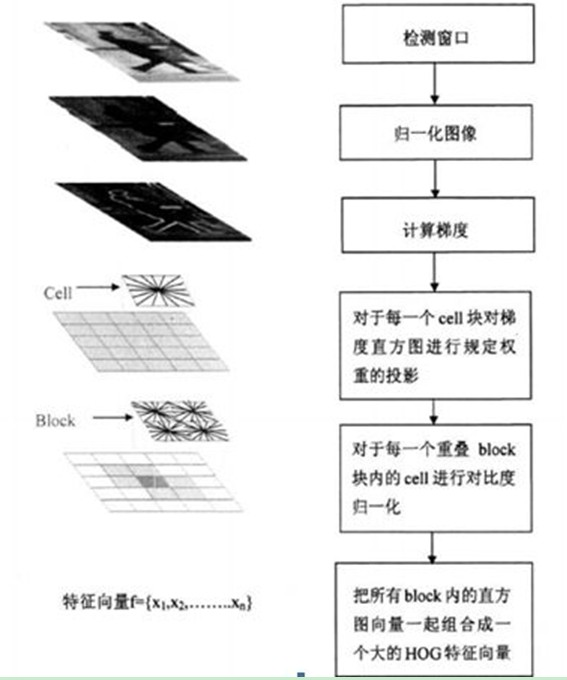
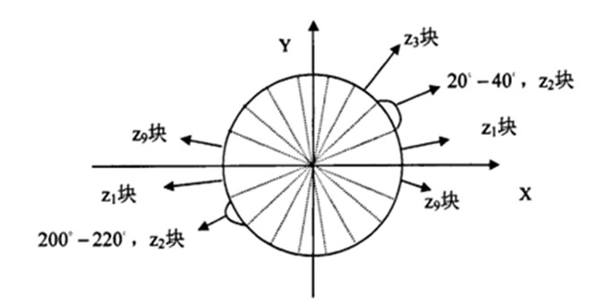
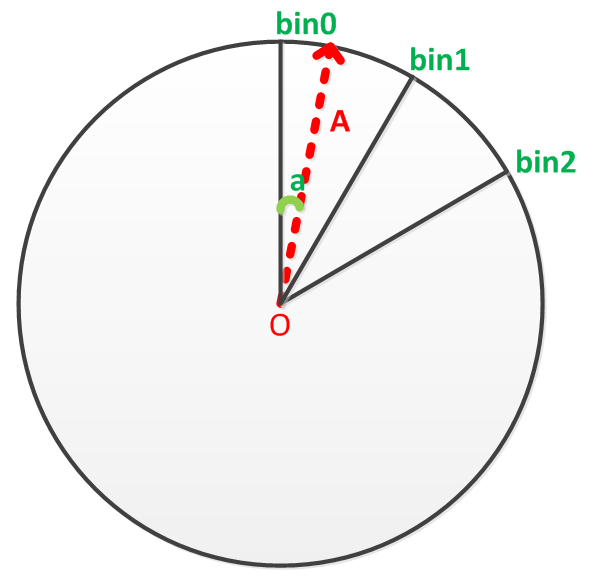
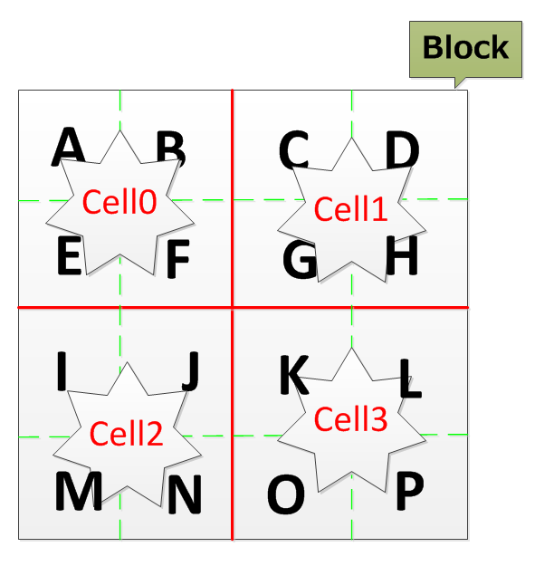
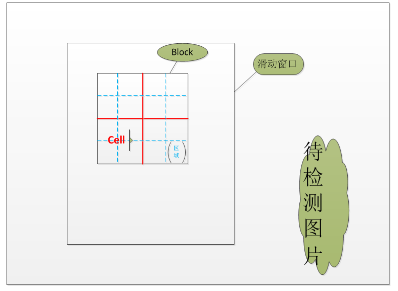

声明：本博客欢迎转发，但请保留原作者信息!
作者: [cwlseu]
博客： <https://cwlseu.github.io/>


## 从特征描述子说起
1. Haar
2. SIFT
3. HOG(Histogram of Oriented Gradient)
    在计算机视觉和图像处理中用来进行物体检测的特征描述子，它通过计算和统计图像局部区域
的梯度方向直方图构成特征。Hog特征结合分类算法广泛应用于图像识别中，尤其是
在行人检测中获得极大成功。HOG+SVM的行人检测方法2005年提出来之后，如今很多
行人检测算法都是以此为思路的。

### 基本的一些特征检测方法

- [Sharpening](http://fourier.eng.hmc.edu/e161/lectures/gradient/node1.html)
- [High-boost filtering](http://fourier.eng.hmc.edu/e161/lectures/gradient/node2.html)
- [The Gradient Operator](http://fourier.eng.hmc.edu/e161/lectures/gradient/node3.html)
- [Digital Gradient](http://fourier.eng.hmc.edu/e161/lectures/gradient/node3.html)
- [Compass Gradient Operations](http://fourier.eng.hmc.edu/e161/lectures/gradient/node3.html)
- [Edge Detection](http://fourier.eng.hmc.edu/e161/lectures/gradient/node3.html)
- [The Laplace Operator](http://fourier.eng.hmc.edu/e161/lectures/gradient/node3.html)
- [Laplacian of Gaussian (LoG)](http://fourier.eng.hmc.edu/e161/lectures/gradient/node3.html)
- [Difference of Gaussian (DoG)](http://fourier.eng.hmc.edu/e161/lectures/gradient/node3.html)

## HOG特征描述子有什么特性
  
在一副图像中，局部目标的表象和形状（appearance and shape）能够被梯度或边缘的方向密度分布很好地描述。（本质：梯度的统计信息，而梯度主要存在于边缘的地方）

### 实现方法
1. 首先将图像分成小的连通区域，我们把它叫**细胞单元**。然后采集细胞单元中各像素点的梯度的或边缘的方向直方图。最后把这些直方图组合起来就可以构成特征描述器。
2. 为了提高性能，把这些局部直方图在图像的**更大的范围内（我们把它叫区间或block）**进行对比度归一化（contrast-normalized），所采用的方法是：先计算各直方图在这个**block**中的密度，然后根据这个密度对**block**中的各个**细胞单元**做归一化。通过这个归一化后，能对光照变化和阴影获得更好的效果。

### 算法步骤
HOG特征提取方法就是将一个image（你要检测的目标或者扫描窗口):



##### 灰度化（将图像看做一个x,y,h（灰度）的三维图像）；
##### 采用Gamma校正法对输入图像进行**颜色空间的标准化（归一化）**
目的是调节图像的对比度，降低图像局部的阴影和光照变化所造成的影响，同时可以抑制噪音的干扰；
为了减少光照因素的影响，首先需要将整个图像进行规范化（归一化）。在图像的纹理强度中，局部的表层曝光贡献的比重较大，所以，这种压缩处理能够有效地降低图像局部的阴影和光照变化。因为颜色信息作用不大，通常先转化为灰度图；$$I(x, y) = I(x, y)^ gramma$$通常gamma取0.5
##### 计算图像每个像素的梯度（包括大小和方向）；主要是为了捕获轮廓信息，同时进一步弱化光照的干扰。
图像中像素点的梯度：

```latex
G_x(x, y) = H(x+1, y) - H(x-1, y)
G_y(x, y) = H(x, y+1) - H(x, y-1)
G(x, y) = \sqrt{G_x(x, y)^2 + G_y(x, y)^2}
\alpha(x, y) = tan^{-1}{\frac{G_y(x, y)}{G_x(x, y)}}
```

##### 将图像划分成小`cells`（例如16*16像素/cell）；

每一个点的梯度角度可能是0~180度之间的任意值，而程序中将其离散化为9个bin，即每个bin占20度。所以滑动窗口中每个像素点的梯度角度如果要离散化到这9个bin中，则一般它都会有2个相邻的bin(如果恰好位于某个bin的中心，则可认为对该bin的权重为1即可)。从源码中可以看到梯度的幅值是用来计算梯度直方图时权重投票的，所以每个像素点的梯度幅值就分解到了其角度相邻的2个bin了，越近的那个bin得到的权重越大。因此幅度图像用了2个通道，每个通道都是原像素点幅度的一个分量。同理，不难理解，像素点的梯度角度也用了2个通道，每个通道中存储的是它相邻2个bin的bin序号。序号小的放在第一通道。

其中，假设那3条半径为离散化后bin的中心，红色虚线为像素点O(像素点在圆心处)的梯度方向，梯度幅值为A，该梯度方向与最近的相邻bin为bin0,这两者之间的夹角为a.这该像素点O处存储的梯度幅值第1通道为A*(1-a),第2通道为A*a;该像素点O处存储的角度第1通道为0(bin的序号为0)，第2通道为1(bin的序号为1)。
另外在计算图像的梯度图和相位图时，如果该图像时3通道的，则3通道分别取梯度值，并且取梯度最大的那个通道的值为该点的梯度幅值。

##### 统计每个cell的梯度直方图（不同梯度的个数），即可形成每个cell的descriptor；

##### 将每几个cell组成一个block（例如2*2个cell/block）
，一个block内所有cell的特征descriptor串联起来便得到该block的HOG特征descriptor。这个在OpenCV中有HogCache中getBlock进行实现的。
如图所示，黑色框代表1个block，红实线隔开的为4个cell，每个cell用绿色虚线隔开的我们称之为4个区域，所以该block中共有16个区域，分别为A、B、C、…、O、P。
将这16个区域分为4组：
第1组：A、D、M、P;该组内的像素点计算梯度方向直方图时只对其所在的cell有贡献。
第2组：B、C、N、O;该组内的像素点计算梯度直方图时对其所在的左右cell有贡献。
第3组：E、I、H、L;该组内的像素点计算梯度直方图时对其所在的上下cell有贡献。
第4组：F、G、J、K;该组内的像素点对其上下左右的cell计算梯度直方图时都有贡献。

那到底是怎么对cell贡献的呢？举个例子来说，E区域内的像素点对cell0和cell2有贡献。本来1个block对滑动窗口贡献的向量维数为36维，即每个cell贡献9维，其顺序分别为cell0,cell1,cell2,cell3.而E区域内的像素由于同时对cell0和cell2有贡献，所以在计算E区域内的像素梯度投票时，不仅要投向它本来的cell0，还要投向下面的cell2，即投向cell0和cell2有一个权重，该权重与该像素点所在位置与cell0，cell2中心位置的距离有关。具体的关系可以去查看源码。

##### 将图像image内的所有block的HOG特征descriptor串联起来就可以得到该image（你要检测的目标）的HOG特征descriptor了。这个就是最终的可供分类使用的特征向量了。



>实际实现的时候，首先用[-1,0,1]梯度算子对原图像做卷积运算，得到x方向（水平方向，以向右为正方向）的梯度分量gradscalx，然后用[1,0,-1]T梯度算子对原图像做卷积运算，得到y方向（竖直方向，以向上为正方向）的梯度分量gradscaly。然后再用以上公式计算该像素点的梯度大小和方向。

### HOG源码分析

在读源码时，由于里面用到了intel的ipp库，优化了算法的速度。为了学习方便，我对OpenCV中关于加速的
部分进行了删减，只剩下算法的精要部分。


	头文件中有关于一些参数的默认设置：
	检测窗口大小为128*64;
	Block大小为16*16；
	Cell大小为8*8；
	Block在检测窗口中上下移动尺寸为8*8；
	1个cell的梯度直方图化成9个bin；
	滑动窗口在检测图片中滑动的尺寸为8*8；

#### 头文件

```cpp
//HOG (Histogram-of-Oriented-Gradients) Descriptor and Object Detector //

//! struct for detection region of interest (ROI)
struct DetectionROI
{
   //! scale(size) of the bounding box
   double scale;
   //! set of requrested locations to be evaluated
   std::vector<cv::Point> locations;
   //! vector that will contain confidence values for each location
   std::vector<double> confidences;
};

struct HOGDescriptor
{
public:
    enum { L2Hys = 0};
    enum { DEFAULT_NLEVELS = 64};

    HOGDescriptor() : winSize(64,128), blockSize(16,16), blockStride(8,8),
        cellSize(8,8), nbins(9), derivAperture(1), winSigma(-1),
        histogramNormType(HOGDescriptor::L2Hys), L2HysThreshold(0.2), gammaCorrection(true),
        free_coef(-1.f), nlevels(HOGDescriptor::DEFAULT_NLEVELS), signedGradient(false)
    {}

    //! with found weights output
    virtual void detect(const Mat& img, std::vector<Point>& foundLocations,
                        std::vector<double>& weights,
                        double hitThreshold = 0, Size winStride = Size(),
                        Size padding = Size(),
                        const std::vector<Point>& searchLocations = std::vector<Point>()) const;
    //! without found weights output
    virtual void detect(const Mat& img, std::vector<Point>& foundLocations,
                        double hitThreshold = 0, Size winStride = Size(),
                        Size padding = Size(),
                        const std::vector<Point>& searchLocations=std::vector<Point>()) const;

    //! with result weights output
    virtual void detectMultiScale(InputArray img, std::vector<Rect>& foundLocations,
                                  std::vector<double>& foundWeights, double hitThreshold = 0,
                                  Size winStride = Size(), Size padding = Size(), double scale = 1.05,
                                  double finalThreshold = 2.0,bool useMeanshiftGrouping = false) const;
    //! without found weights output
    virtual void detectMultiScale(InputArray img, std::vector<Rect>& foundLocations,
                                  double hitThreshold = 0, Size winStride = Size(),
                                  Size padding = Size(), double scale = 1.05,
                                  double finalThreshold = 2.0, bool useMeanshiftGrouping = false) const;

    virtual void computeGradient(const Mat& img, Mat& grad, Mat& angleOfs,
                                 Size paddingTL = Size(), Size paddingBR = Size()) const;

    static std::vector<float> getDefaultPeopleDetector();
    static std::vector<float> getDaimlerPeopleDetector();

    Size winSize;		// 窗口大小 64x128
    Size blockSize;		// block size 16x16
    Size blockStride;	// block 之间的stride
    Size cellSize;		// cell的size
    int nbins;			// 
    int derivAperture;	//
    double winSigma;
    int histogramNormType;
    double L2HysThreshold;
    bool gammaCorrection;
    std::vector<float> svmDetector;
    UMat oclSvmDetector;
    float free_coef;
    int nlevels;
    bool signedGradient;


    //! evaluate specified ROI and return confidence value for each location
    virtual void detectROI(const cv::Mat& img, const std::vector<cv::Point> &locations,
                                   std::vector<cv::Point>& foundLocations, std::vector<double>& confidences,
                                   double hitThreshold = 0, cv::Size winStride = Size(),
                                   cv::Size padding = Size()) const;

    //! evaluate specified ROI and return confidence value for each location in multiple scales
    virtual void detectMultiScaleROI(const cv::Mat& img,
                                                       std::vector<cv::Rect>& foundLocations,
                                                       std::vector<DetectionROI>& locations,
                                                       double hitThreshold = 0,
                                                       int groupThreshold = 0) const;

};

//! @} objdetect
```

### 源文件

```cpp

#include "cascadedetect.hpp"
#include "opencv2/core/core_c.h"
#include "opencl_kernels_objdetect.hpp"

#include <cstdio>
#include <iterator>
#include <limits>

/****************************************************************************************\
      The code below is implementation of HOG (Histogram-of-Oriented Gradients)
      descriptor and object detection, introduced by Navneet Dalal and Bill Triggs.

      The computed feature vectors are compatible with the
      INRIA Object Detection and Localization Toolkit
      (http://pascal.inrialpes.fr/soft/olt/)
\****************************************************************************************/

namespace cv
{

#define NTHREADS 256

enum {DESCR_FORMAT_COL_BY_COL, DESCR_FORMAT_ROW_BY_ROW};

static int numPartsWithin(int size, int part_size, int stride)
{
    return (size - part_size + stride) / stride;
}

static Size numPartsWithin(cv::Size size, cv::Size part_size,
                                                cv::Size stride)
{
    return Size(numPartsWithin(size.width, part_size.width, stride.width),
        numPartsWithin(size.height, part_size.height, stride.height));
}

static size_t getBlockHistogramSize(Size block_size, Size cell_size, int nbins)
{
    Size cells_per_block = Size(block_size.width / cell_size.width,
        block_size.height / cell_size.height);
    return (size_t)(nbins * cells_per_block.area());
}

size_t HOGDescriptor::getDescriptorSize() const
{
    CV_Assert(blockSize.width % cellSize.width == 0 &&
        blockSize.height % cellSize.height == 0);
    CV_Assert((winSize.width - blockSize.width) % blockStride.width == 0 &&
        (winSize.height - blockSize.height) % blockStride.height == 0 );

    return (size_t)nbins*
        (blockSize.width/cellSize.width)*
        (blockSize.height/cellSize.height)*
        ((winSize.width - blockSize.width)/blockStride.width + 1)*
        ((winSize.height - blockSize.height)/blockStride.height + 1);
}

double HOGDescriptor::getWinSigma() const
{
    return winSigma >= 0 ? winSigma : (blockSize.width + blockSize.height)/8.;
}

bool HOGDescriptor::checkDetectorSize() const
{
    size_t detectorSize = svmDetector.size(), descriptorSize = getDescriptorSize();
    return detectorSize == 0 ||
        detectorSize == descriptorSize ||
        detectorSize == descriptorSize + 1;
}

void HOGDescriptor::setSVMDetector(InputArray _svmDetector)
{
    _svmDetector.getMat().convertTo(svmDetector, CV_32F);
    CV_Assert(checkDetectorSize());

    Mat detector_reordered(1, (int)svmDetector.size(), CV_32FC1);

    size_t block_hist_size = getBlockHistogramSize(blockSize, cellSize, nbins);
    cv::Size blocks_per_img = numPartsWithin(winSize, blockSize, blockStride);

    for (int i = 0; i < blocks_per_img.height; ++i)
        for (int j = 0; j < blocks_per_img.width; ++j)
        {
            const float *src = &svmDetector[0] + (j * blocks_per_img.height + i) * block_hist_size;
            float *dst = detector_reordered.ptr<float>() + (i * blocks_per_img.width + j) * block_hist_size;
            for (size_t k = 0; k < block_hist_size; ++k)
                dst[k] = src[k];
        }
    size_t descriptor_size = getDescriptorSize();
    free_coef = svmDetector.size() > descriptor_size ? svmDetector[descriptor_size] : 0;
    detector_reordered.copyTo(oclSvmDetector);
}

#define CV_TYPE_NAME_HOG_DESCRIPTOR "opencv-object-detector-hog"


// @img [input] 计算图像img
// @grad [output] 梯度幅度图像`grad`
// @qangle [output] 梯度方向图像`qangle`.
// @paddingTL为需要在原图像img左上角扩增的尺寸，同理paddingBR
// @paddingBR 为需要在img图像右下角扩增的尺寸。
void HOGDescriptor::computeGradient(const Mat& img, Mat& grad, Mat& qangle,
    Size paddingTL, Size paddingBR) const
{
    CV_INSTRUMENT_REGION()

    CV_Assert( img.type() == CV_8U || img.type() == CV_8UC3 );
    // padding之后的输出大小
    Size gradsize(img.cols + paddingTL.width + paddingBR.width,
        img.rows + paddingTL.height + paddingBR.height);
    grad.create(gradsize, CV_32FC2);  // <magnitude*(1-alpha), magnitude*alpha>
    qangle.create(gradsize, CV_8UC2); // [0..nbins-1] - quantized gradient orientation

    Size wholeSize;
    Point roiofs;
    img.locateROI(wholeSize, roiofs);

    int i, x, y;
    int cn = img.channels();

    Mat_<float> _lut(1, 256);
    const float* const lut = &_lut(0,0);

    if( gammaCorrection )
        for( i = 0; i < 256; i++ )
            _lut(0,i) = std::sqrt((float)i);
    else
        for( i = 0; i < 256; i++ )
            _lut(0,i) = (float)i;

    AutoBuffer<int> mapbuf(gradsize.width + gradsize.height + 4);
    int* xmap = (int*)mapbuf + 1;
    int* ymap = xmap + gradsize.width + 2;

    const int borderType = (int)BORDER_REFLECT_101;

    for( x = -1; x < gradsize.width + 1; x++ )
        xmap[x] = borderInterpolate(x - paddingTL.width + roiofs.x,
        wholeSize.width, borderType) - roiofs.x;
    for( y = -1; y < gradsize.height + 1; y++ )
        ymap[y] = borderInterpolate(y - paddingTL.height + roiofs.y,
        wholeSize.height, borderType) - roiofs.y;

    // x- & y- derivatives for the whole row
    int width = gradsize.width;
    AutoBuffer<float> _dbuf(width*4);
    float* const dbuf = _dbuf;
    Mat Dx(1, width, CV_32F, dbuf);
    Mat Dy(1, width, CV_32F, dbuf + width);
    Mat Mag(1, width, CV_32F, dbuf + width*2);
    Mat Angle(1, width, CV_32F, dbuf + width*3);

    if (cn == 3)
    {
        int end = gradsize.width + 2;
        xmap -= 1, x = 0;
        for ( ; x < end; ++x)
            xmap[x] *= 3;
        xmap += 1;
    }

    float angleScale = signedGradient ? (float)(nbins/(2.0*CV_PI)) : (float)(nbins/CV_PI);
    for( y = 0; y < gradsize.height; y++ )
    {
        const uchar* imgPtr  = img.ptr(ymap[y]);
        //In case subimage is used ptr() generates an assert for next and prev rows
        //(see http://code.opencv.org/issues/4149)
        const uchar* prevPtr = img.data + img.step*ymap[y-1];
        const uchar* nextPtr = img.data + img.step*ymap[y+1];

        float* gradPtr = grad.ptr<float>(y);
        uchar* qanglePtr = qangle.ptr(y);

        if( cn == 1 )
        {
            for( x = 0; x < width; x++ )
            {
                int x1 = xmap[x];
                dbuf[x] = (float)(lut[imgPtr[xmap[x+1]]] - lut[imgPtr[xmap[x-1]]]);
                dbuf[width + x] = (float)(lut[nextPtr[x1]] - lut[prevPtr[x1]]);
            }
        }
        else
        {
            x = 0;
            for( ; x < width; x++ )
            {
                int x1 = xmap[x];
                float dx0, dy0, dx, dy, mag0, mag;
                const uchar* p2 = imgPtr + xmap[x+1];
                const uchar* p0 = imgPtr + xmap[x-1];

                dx0 = lut[p2[2]] - lut[p0[2]];
                dy0 = lut[nextPtr[x1+2]] - lut[prevPtr[x1+2]];
                mag0 = dx0*dx0 + dy0*dy0;

                dx = lut[p2[1]] - lut[p0[1]];
                dy = lut[nextPtr[x1+1]] - lut[prevPtr[x1+1]];
                mag = dx*dx + dy*dy;
                if( mag0 < mag )
                {
                    dx0 = dx;
                    dy0 = dy;
                    mag0 = mag;
                }

                dx = lut[p2[0]] - lut[p0[0]];
                dy = lut[nextPtr[x1]] - lut[prevPtr[x1]];
                mag = dx*dx + dy*dy;
                if( mag0 < mag )
                {
                    dx0 = dx;
                    dy0 = dy;
                    mag0 = mag;
                }

                dbuf[x] = dx0;
                dbuf[x+width] = dy0;
            }
        }

        // computing angles and magnidutes
        cartToPolar( Dx, Dy, Mag, Angle, false );

        // filling the result matrix
        x = 0;

        for( ; x < width; x++ )
        {
            float mag = dbuf[x+width*2], angle = dbuf[x+width*3]*angleScale - 0.5f;
            int hidx = cvFloor(angle);
            angle -= hidx;
            gradPtr[x*2] = mag*(1.f - angle);
            gradPtr[x*2+1] = mag*angle;

            if( hidx < 0 )
                hidx += nbins;
            else if( hidx >= nbins )
                hidx -= nbins;

            CV_Assert( (unsigned)hidx < (unsigned)nbins );

            qanglePtr[x*2] = (uchar)hidx;
            hidx++;
            hidx &= hidx < nbins ? -1 : 0;
            qanglePtr[x*2+1] = (uchar)hidx;
        }
    }
}

struct HOGCache
{
	// 1个BlockData结构体是对应的一个block数据。
	// 其中histOfs表示为该block对整个滑动窗口内hog描述算子的贡献那部分向量的起始位置；
	// imgOffset为该block在滑动窗口图片中的坐标(当然是指左上角坐标)
    struct BlockData
    {
        BlockData() :
            histOfs(0), imgOffset()
        { }

        int histOfs;
        Point imgOffset;
    };
    // PixData结构体是对应的block中1个像素点的数据。
    // 其中gradOfs表示该点的梯度幅度在滑动窗口图片梯度幅度图中的位置坐标；
    // qangleOfs表示该点的梯度角度在滑动窗口图片梯度角度图中的位置坐标；
    // histOfs[]表示该像素点对1个或2个或4个cell贡献的hog描述子向量的起始位置坐标（比较抽象，需要看源码才懂）。
    // histWeight[]表示该像素点对1个或2个或4个cell贡献的权重。
    // gradWeight表示该点本身由于处在block中位置的不同因而对梯度直方图贡献也不同，其权值按照二维高斯分布(以block中心为二维高斯的中心)来决定。
    struct PixData
    {
        size_t gradOfs, qangleOfs;
        int histOfs[4];
        float histWeights[4];
        float gradWeight;
    };

    HOGCache();
    HOGCache(const HOGDescriptor* descriptor,
        const Mat& img, const Size& paddingTL, const Size& paddingBR,
        bool useCache, const Size& cacheStride);
    virtual ~HOGCache() { }
    virtual void init(const HOGDescriptor* descriptor,
        const Mat& img, const Size& paddingTL, const Size& paddingBR,
        bool useCache, const Size& cacheStride);

    Size windowsInImage(const Size& imageSize, const Size& winStride) const;
    Rect getWindow(const Size& imageSize, const Size& winStride, int idx) const;

    const float* getBlock(Point pt, float* buf);
    // 指对block获取到的hog部分描述子进行归一化，其实该归一化有2层，具体看代码。
    virtual void normalizeBlockHistogram(float* histogram) const;

    std::vector<PixData> pixData;
    std::vector<BlockData> blockData;

    bool useCache;
    std::vector<int> ymaxCached;
    Size winSize;
    Size cacheStride;
    Size nblocks, ncells;
    int blockHistogramSize;
    int count1, count2, count4;
    Point imgoffset;
    Mat_<float> blockCache;
    Mat_<uchar> blockCacheFlags;

    Mat grad, qangle;
    const HOGDescriptor* descriptor;
};

HOGCache::HOGCache() :
    blockHistogramSize(), count1(), count2(), count4()
{
    useCache = false;
    descriptor = 0;
}

HOGCache::HOGCache(const HOGDescriptor* _descriptor,
    const Mat& _img, const Size& _paddingTL, const Size& _paddingBR,
    bool _useCache, const Size& _cacheStride)
{
    init(_descriptor, _img, _paddingTL, _paddingBR, _useCache, _cacheStride);
}

void HOGCache::init(const HOGDescriptor* _descriptor,
    const Mat& _img, const Size& _paddingTL, const Size& _paddingBR,
    bool _useCache, const Size& _cacheStride)
{
    descriptor = _descriptor;
    cacheStride = _cacheStride;
    useCache = _useCache;
    // 计算输入图像的权值梯度幅度图和角度量化图
    descriptor->computeGradient(_img, grad, qangle, _paddingTL, _paddingBR);
    imgoffset = _paddingTL;

    winSize = descriptor->winSize;
    Size blockSize = descriptor->blockSize;
    Size blockStride = descriptor->blockStride;
    Size cellSize = descriptor->cellSize;
    int i, j, nbins = descriptor->nbins;
    // rawBlockSize为block中包含像素点的个数
    int rawBlockSize = blockSize.width*blockSize.height;
    // block的数目
    nblocks = Size((winSize.width - blockSize.width)/blockStride.width + 1,
        (winSize.height - blockSize.height)/blockStride.height + 1);
    // cell的数目
    ncells = Size(blockSize.width/cellSize.width, blockSize.height/cellSize.height);
    // blockHistogramSize表示一个block中贡献给hog描述子向量的长度
    blockHistogramSize = ncells.width*ncells.height*nbins;

    if( useCache )
    {
        Size cacheSize((grad.cols - blockSize.width)/cacheStride.width+1,
            (winSize.height/cacheStride.height)+1);

        blockCache.create(cacheSize.height, cacheSize.width*blockHistogramSize);
        blockCacheFlags.create(cacheSize);

        size_t cacheRows = blockCache.rows;
        ymaxCached.resize(cacheRows);
        for(size_t ii = 0; ii < cacheRows; ii++ )
            ymaxCached[ii] = -1;
    }
    // weights为一个尺寸为blockSize的二维高斯表,下面的代码就是计算二维高斯的系数
    Mat_<float> weights(blockSize);
    float sigma = (float)descriptor->getWinSigma();
    float scale = 1.f/(sigma*sigma*2);

    {
        AutoBuffer<float> di(blockSize.height), dj(blockSize.width);
        float* _di = (float*)di, *_dj = (float*)dj;
        float bh = blockSize.height * 0.5f, bw = blockSize.width * 0.5f;

        for (i = 0; i < blockSize.height; ++i)
        {
            _di[i] = i - bh;
            _di[i] *= _di[i];
        }

        for (j = 0;; j < blockSize.width; ++j)
        {
            _dj[j] = j - bw;
            _dj[j] *= _dj[j];
        }

        for(i = 0; i < blockSize.height; i++)
            for(j = 0; j < blockSize.width; j++)
                weights(i,j) = std::exp(-(_di[i] + _dj[j])*scale);
    }

	// vector<BlockData> blockData;而BlockData为HOGCache的一个结构体成员
	// nblocks.width*nblocks.height表示一个检测窗口中block的个数，
	// 而cacheSize.width*cacheSize.heigh表示一个已经扩充的图片中的block的个数
    blockData.resize(nblocks.width*nblocks.height);
    // vector<PixData> pixData; 同理，Pixdata也为HOGCache中的一个结构体成员
    // rawBlockSize表示每个block中像素点的个数
    // resize表示将其转换成列向量
    // rawBlockSize*3表示的是存储同时对1个cell，2个cell，4个cell的贡献
    pixData.resize(rawBlockSize*3);

    // Initialize 2 lookup tables, pixData & blockData.
    // Here is why:
    //
    // The detection algorithm runs in 4 nested loops (at each pyramid layer):
    //  loop over the windows within the input image
    //    loop over the blocks within each window
    //      loop over the cells within each block
    //        loop over the pixels in each cell
    //
    // As each of the loops runs over a 2-dimensional array,
    // we could get 8(!) nested loops in total, which is very-very slow.
    //
    // To speed the things up, we do the following:
    //   1. loop over windows is unrolled in the HOGDescriptor::{compute|detect} methods;
    //         inside we compute the current search window using getWindow() method.
    //         Yes, it involves some overhead (function call + couple of divisions),
    //         but it's tiny in fact.
    //   2. loop over the blocks is also unrolled. Inside we use **pre-computed** blockData[j]
    //         to set up gradient and histogram pointers.
    //   3. loops over cells and pixels in each cell are merged
    //       (since there is no overlap between cells, each pixel in the block is processed once)
    //      and also unrolled. Inside we use PixData[k] to access the gradient values and
    //      update the histogram
    //

    // count1, count2, count4分别表示block中同时对1个cell，2个cell，4个cell有贡献的像素点的个数。
    count1 = count2 = count4 = 0;
    for( j = 0; j < blockSize.width; j++ )
        for( i = 0; i < blockSize.height; i++ )
        {
            PixData* data = 0;
            float cellX = (j+0.5f)/cellSize.width - 0.5f;
            float cellY = (i+0.5f)/cellSize.height - 0.5f;
            int icellX0 = cvFloor(cellX);
            int icellY0 = cvFloor(cellY);
            int icellX1 = icellX0 + 1, icellY1 = icellY0 + 1;
            cellX -= icellX0;
            cellY -= icellY0;

            if( (unsigned)icellX0 < (unsigned)ncells.width &&
               (unsigned)icellX1 < (unsigned)ncells.width )
            {
                if( (unsigned)icellY0 < (unsigned)ncells.height &&
                   (unsigned)icellY1 < (unsigned)ncells.height )
                {
                    data = &pixData[rawBlockSize*2 + (count4++)];
                    data->histOfs[0] = (icellX0*ncells.height + icellY0)*nbins;
                    data->histWeights[0] = (1.f - cellX)*(1.f - cellY);
                    data->histOfs[1] = (icellX1*ncells.height + icellY0)*nbins;
                    data->histWeights[1] = cellX*(1.f - cellY);
                    data->histOfs[2] = (icellX0*ncells.height + icellY1)*nbins;
                    data->histWeights[2] = (1.f - cellX)*cellY;
                    data->histOfs[3] = (icellX1*ncells.height + icellY1)*nbins;
                    data->histWeights[3] = cellX*cellY;
                }
                else
                {
                    data = &pixData[rawBlockSize + (count2++)];
                    if( (unsigned)icellY0 < (unsigned)ncells.height )
                    {
                        icellY1 = icellY0;
                        cellY = 1.f - cellY;
                    }
                    data->histOfs[0] = (icellX0*ncells.height + icellY1)*nbins;
                    data->histWeights[0] = (1.f - cellX)*cellY;
                    data->histOfs[1] = (icellX1*ncells.height + icellY1)*nbins;
                    data->histWeights[1] = cellX*cellY;
                    data->histOfs[2] = data->histOfs[3] = 0;
                    data->histWeights[2] = data->histWeights[3] = 0;
                }
            }
            else
            {
                if( (unsigned)icellX0 < (unsigned)ncells.width )
                {
                    icellX1 = icellX0;
                    cellX = 1.f - cellX;
                }

                if( (unsigned)icellY0 < (unsigned)ncells.height &&
                   (unsigned)icellY1 < (unsigned)ncells.height )
                {
                    data = &pixData[rawBlockSize + (count2++)];
                    data->histOfs[0] = (icellX1*ncells.height + icellY0)*nbins;
                    data->histWeights[0] = cellX*(1.f - cellY);
                    data->histOfs[1] = (icellX1*ncells.height + icellY1)*nbins;
                    data->histWeights[1] = cellX*cellY;
                    data->histOfs[2] = data->histOfs[3] = 0;
                    data->histWeights[2] = data->histWeights[3] = 0;
                }
                else
                {
                    data = &pixData[count1++];
                    if( (unsigned)icellY0 < (unsigned)ncells.height )
                    {
                        icellY1 = icellY0;
                        cellY = 1.f - cellY;
                    }
                    data->histOfs[0] = (icellX1*ncells.height + icellY1)*nbins;
                    data->histWeights[0] = cellX*cellY;
                    data->histOfs[1] = data->histOfs[2] = data->histOfs[3] = 0;
                    data->histWeights[1] = data->histWeights[2] = data->histWeights[3] = 0;
                }
            }
            data->gradOfs = (grad.cols*i + j)*2;
            data->qangleOfs = (qangle.cols*i + j)*2;
            data->gradWeight = weights(i,j);
        }

    assert( count1 + count2 + count4 == rawBlockSize );
    // defragment pixData
    for( j = 0; j < count2; j++ )
        pixData[j + count1] = pixData[j + rawBlockSize];
    for( j = 0; j < count4; j++ )
        pixData[j + count1 + count2] = pixData[j + rawBlockSize*2];
    count2 += count1;
    count4 += count2;

    // initialize blockData
    for( j = 0; j < nblocks.width; j++ )
        for( i = 0; i < nblocks.height; i++ )
        {
            BlockData& data = blockData[j*nblocks.height + i];
            data.histOfs = (j*nblocks.height + i)*blockHistogramSize;
            data.imgOffset = Point(j*blockStride.width,i*blockStride.height);
        }
}
// 计算一个block中的特征子
const float* HOGCache::getBlock(Point pt, float* buf)
{
    float* blockHist = buf;
    assert(descriptor != 0);

//    Size blockSize = descriptor->blockSize;
    pt += imgoffset;

//    CV_Assert( (unsigned)pt.x <= (unsigned)(grad.cols - blockSize.width) &&
//        (unsigned)pt.y <= (unsigned)(grad.rows - blockSize.height) );

    if( useCache )
    {
        CV_Assert( pt.x % cacheStride.width == 0 &&
                   pt.y % cacheStride.height == 0 );
        Point cacheIdx(pt.x/cacheStride.width,
                       (pt.y/cacheStride.height) % blockCache.rows);
        if( pt.y != ymaxCached[cacheIdx.y] )
        {
            Mat_<uchar> cacheRow = blockCacheFlags.row(cacheIdx.y);
            cacheRow = (uchar)0;
            ymaxCached[cacheIdx.y] = pt.y;
        }

        blockHist = &blockCache[cacheIdx.y][cacheIdx.x*blockHistogramSize];
        uchar& computedFlag = blockCacheFlags(cacheIdx.y, cacheIdx.x);
        if( computedFlag != 0 )
            return blockHist;
        computedFlag = (uchar)1; // set it at once, before actual computing
    }

    int k, C1 = count1, C2 = count2, C4 = count4;
    const float* gradPtr = grad.ptr<float>(pt.y) + pt.x*2;
    const uchar* qanglePtr = qangle.ptr(pt.y) + pt.x*2;

//    CV_Assert( blockHist != 0 );
    memset(blockHist, 0, sizeof(float) * blockHistogramSize);

    const PixData* _pixData = &pixData[0];
    // 统计各个cell中的bin信息
    for( k = 0; k < C1; k++ )
    {
        const PixData& pk = _pixData[k];
        const float* const a = gradPtr + pk.gradOfs;
        float w = pk.gradWeight*pk.histWeights[0];
        const uchar* h = qanglePtr + pk.qangleOfs;
        int h0 = h[0], h1 = h[1];

        float* hist = blockHist + pk.histOfs[0];
        float t0 = hist[h0] + a[0]*w;
        float t1 = hist[h1] + a[1]*w;
        hist[h0] = t0; hist[h1] = t1;
    }

    for( ; k < C2; k++ )
    {
        const PixData& pk = _pixData[k];
        const float* const a = gradPtr + pk.gradOfs;
        float w, t0, t1, a0 = a[0], a1 = a[1];
        const uchar* const h = qanglePtr + pk.qangleOfs;
        int h0 = h[0], h1 = h[1];

        float* hist = blockHist + pk.histOfs[0];
        w = pk.gradWeight*pk.histWeights[0];
        t0 = hist[h0] + a0*w;
        t1 = hist[h1] + a1*w;
        hist[h0] = t0; hist[h1] = t1;

        hist = blockHist + pk.histOfs[1];
        w = pk.gradWeight*pk.histWeights[1];
        t0 = hist[h0] + a0*w;
        t1 = hist[h1] + a1*w;
        hist[h0] = t0; hist[h1] = t1;
    }

    for( ; k < C4; k++ )
    {
        const PixData& pk = _pixData[k];
        const float* a = gradPtr + pk.gradOfs;
        float w, t0, t1, a0 = a[0], a1 = a[1];
        const uchar* h = qanglePtr + pk.qangleOfs;
        int h0 = h[0], h1 = h[1];

        float* hist = blockHist + pk.histOfs[0];
        w = pk.gradWeight*pk.histWeights[0];
        t0 = hist[h0] + a0*w;
        t1 = hist[h1] + a1*w;
        hist[h0] = t0; hist[h1] = t1;

        hist = blockHist + pk.histOfs[1];
        w = pk.gradWeight*pk.histWeights[1];
        t0 = hist[h0] + a0*w;
        t1 = hist[h1] + a1*w;
        hist[h0] = t0; hist[h1] = t1;

        hist = blockHist + pk.histOfs[2];
        w = pk.gradWeight*pk.histWeights[2];
        t0 = hist[h0] + a0*w;
        t1 = hist[h1] + a1*w;
        hist[h0] = t0; hist[h1] = t1;

        hist = blockHist + pk.histOfs[3];
        w = pk.gradWeight*pk.histWeights[3];
        t0 = hist[h0] + a0*w;
        t1 = hist[h1] + a1*w;
        hist[h0] = t0; hist[h1] = t1;
    }
    // 归一化 block中的Hist
    normalizeBlockHistogram(blockHist);

    return blockHist;
}

void HOGCache::normalizeBlockHistogram(float* _hist) const
{
    float* hist = &_hist[0], sum = 0.0f;
    size_t i = 0, sz = blockHistogramSize;

    for (i = 0 ; i < sz; ++i)
        sum += hist[i]*hist[i];

    float scale = 1.f/(std::sqrt(sum)+sz*0.1f), thresh = (float)descriptor->L2HysThreshold;
    sum = 0.0f;

    for(i = 0; i < sz; ++i)
    {
        hist[i] = std::min(hist[i]*scale, thresh);
        sum += hist[i]*hist[i];
    }

    scale = 1.f/(std::sqrt(sum)+1e-3f), i = 0;

    for ( ; i < sz; ++i)
        hist[i] *= scale;
}

Size HOGCache::windowsInImage(const Size& imageSize, const Size& winStride) const
{
    return Size((imageSize.width - winSize.width)/winStride.width + 1,
        (imageSize.height - winSize.height)/winStride.height + 1);
}

Rect HOGCache::getWindow(const Size& imageSize, const Size& winStride, int idx) const
{
    int nwindowsX = (imageSize.width - winSize.width)/winStride.width + 1;
    int y = idx / nwindowsX;
    int x = idx - nwindowsX*y;
    return Rect( x*winStride.width, y*winStride.height, winSize.width, winSize.height );
}

static inline int gcd(int a, int b)
{
    if( a < b )
        std::swap(a, b);
    while( b > 0 )
    {
        int r = a % b;
        a = b;
        b = r;
    }
    return a;
}


void HOGDescriptor::compute(InputArray _img, std::vector<float>& descriptors,
    Size winStride, Size padding, const std::vector<Point>& locations) const
{
    CV_INSTRUMENT_REGION()

    if( winStride == Size() )
        winStride = cellSize;
    Size cacheStride(gcd(winStride.width, blockStride.width),
                     gcd(winStride.height, blockStride.height));

    Size imgSize = _img.size();

    size_t nwindows = locations.size();
    padding.width = (int)alignSize(std::max(padding.width, 0), cacheStride.width);
    padding.height = (int)alignSize(std::max(padding.height, 0), cacheStride.height);
    Size paddedImgSize(imgSize.width + padding.width*2, imgSize.height + padding.height*2);

    Mat img = _img.getMat();
    HOGCache cache(this, img, padding, padding, nwindows == 0, cacheStride);
    // 获取图片中windows的个数
    if( !nwindows )
        nwindows = cache.windowsInImage(paddedImgSize, winStride).area();

    const HOGCache::BlockData* blockData = &cache.blockData[0];

    int nblocks = cache.nblocks.area();
    int blockHistogramSize = cache.blockHistogramSize;
    size_t dsize = getDescriptorSize();
    descriptors.resize(dsize*nwindows);

    // for each window
    for( size_t i = 0; i < nwindows; i++ )
    {
        float* descriptor = &descriptors[i*dsize];

        Point pt0;
        if( !locations.empty() )
        {
            pt0 = locations[i];
            if( pt0.x < -padding.width || pt0.x > img.cols + padding.width - winSize.width ||
                pt0.y < -padding.height || pt0.y > img.rows + padding.height - winSize.height )
                continue;
        }
        else
        {
            pt0 = cache.getWindow(paddedImgSize, winStride, (int)i).tl() - Point(padding);
        }

        for( int j = 0; j < nblocks; j++ )
        {
            const HOGCache::BlockData& bj = blockData[j];
            Point pt = pt0 + bj.imgOffset;

            float* dst = descriptor + bj.histOfs;
            const float* src = cache.getBlock(pt, dst);
            if( src != dst ) memcpy(dst, src, blockHistogramSize * sizeof(float));
        }
    }
}

void HOGDescriptor::detect(const Mat& img,
    std::vector<Point>& hits, std::vector<double>& weights, double hitThreshold,
    Size winStride, Size padding, const std::vector<Point>& locations) const
{
    CV_INSTRUMENT_REGION()

    hits.clear();
    weights.clear();
    if( svmDetector.empty() )
        return;

    if( winStride == Size() )
        winStride = cellSize;
    Size cacheStride(gcd(winStride.width, blockStride.width),
        gcd(winStride.height, blockStride.height));

    size_t nwindows = locations.size();
    padding.width = (int)alignSize(std::max(padding.width, 0), cacheStride.width);
    padding.height = (int)alignSize(std::max(padding.height, 0), cacheStride.height);
    Size paddedImgSize(img.cols + padding.width*2, img.rows + padding.height*2);

    HOGCache cache(this, img, padding, padding, nwindows == 0, cacheStride);

    if( !nwindows )
        nwindows = cache.windowsInImage(paddedImgSize, winStride).area();

    const HOGCache::BlockData* blockData = &cache.blockData[0];

    int nblocks = cache.nblocks.area();
    int blockHistogramSize = cache.blockHistogramSize;
    size_t dsize = getDescriptorSize();

    double rho = svmDetector.size() > dsize ? svmDetector[dsize] : 0;
    std::vector<float> blockHist(blockHistogramSize);


    for( size_t i = 0; i < nwindows; i++ )
    {
        Point pt0;
        if( !locations.empty() )
        {
            pt0 = locations[i];
            if( pt0.x < -padding.width || pt0.x > img.cols + padding.width - winSize.width ||
                    pt0.y < -padding.height || pt0.y > img.rows + padding.height - winSize.height )
                continue;
        }
        else
        {
            pt0 = cache.getWindow(paddedImgSize, winStride, (int)i).tl() - Point(padding);
            CV_Assert(pt0.x % cacheStride.width == 0 && pt0.y % cacheStride.height == 0);
        }
        double s = rho;
        const float* svmVec = &svmDetector[0];

        int j, k;
        for( j = 0; j < nblocks; j++, svmVec += blockHistogramSize )
        {
            const HOGCache::BlockData& bj = blockData[j];
            Point pt = pt0 + bj.imgOffset;

            const float* vec = cache.getBlock(pt, &blockHist[0]);

            for(k = 0 ; k < blockHistogramSize; k++ )
                s += vec[k]*svmVec[k];
        }
        if( s >= hitThreshold )
        {
            hits.push_back(pt0);
            weights.push_back(s);
        }
    }
}

void HOGDescriptor::detect(const Mat& img, std::vector<Point>& hits, double hitThreshold,
    Size winStride, Size padding, const std::vector<Point>& locations) const
{
    CV_INSTRUMENT_REGION()

    std::vector<double> weightsV;
    detect(img, hits, weightsV, hitThreshold, winStride, padding, locations);
}

class HOGInvoker : public ParallelLoopBody
{
public:
    HOGInvoker( const HOGDescriptor* _hog, const Mat& _img,
        double _hitThreshold, const Size& _winStride, const Size& _padding,
        const double* _levelScale, std::vector<Rect> * _vec, Mutex* _mtx,
        std::vector<double>* _weights=0, std::vector<double>* _scales=0 )
    {
        hog = _hog;
        img = _img;
        hitThreshold = _hitThreshold;
        winStride = _winStride;
        padding = _padding;
        levelScale = _levelScale;
        vec = _vec;
        weights = _weights;
        scales = _scales;
        mtx = _mtx;
    }

    void operator()( const Range& range ) const
    {
        int i, i1 = range.start, i2 = range.end;
        double minScale = i1 > 0 ? levelScale[i1] : i2 > 1 ? levelScale[i1+1] : std::max(img.cols, img.rows);
        Size maxSz(cvCeil(img.cols/minScale), cvCeil(img.rows/minScale));
        Mat smallerImgBuf(maxSz, img.type());
        std::vector<Point> locations;
        std::vector<double> hitsWeights;

        for( i = i1; i < i2; i++ )
        {
            double scale = levelScale[i];
            Size sz(cvRound(img.cols/scale), cvRound(img.rows/scale));
            Mat smallerImg(sz, img.type(), smallerImgBuf.ptr());
            if( sz == img.size() )
                smallerImg = Mat(sz, img.type(), img.data, img.step);
            else
                resize(img, smallerImg, sz);
            hog->detect(smallerImg, locations, hitsWeights, hitThreshold, winStride, padding);
            Size scaledWinSize = Size(cvRound(hog->winSize.width*scale), cvRound(hog->winSize.height*scale));

            mtx->lock();
            for( size_t j = 0; j < locations.size(); j++ )
            {
                vec->push_back(Rect(cvRound(locations[j].x*scale),
                                    cvRound(locations[j].y*scale),
                                    scaledWinSize.width, scaledWinSize.height));
                if (scales)
                    scales->push_back(scale);
            }
            mtx->unlock();

            if (weights && (!hitsWeights.empty()))
            {
                mtx->lock();
                for (size_t j = 0; j < locations.size(); j++)
                    weights->push_back(hitsWeights[j]);
                mtx->unlock();
            }
        }
    }

private:
    const HOGDescriptor* hog;
    Mat img;
    double hitThreshold;
    Size winStride;
    Size padding;
    const double* levelScale;
    std::vector<Rect>* vec;
    std::vector<double>* weights;
    std::vector<double>* scales;
    Mutex* mtx;
};


void HOGDescriptor::detectMultiScale(
    InputArray _img, std::vector<Rect>& foundLocations, std::vector<double>& foundWeights,
    double hitThreshold, Size winStride, Size padding,
    double scale0, double finalThreshold, bool useMeanshiftGrouping) const
{
    CV_INSTRUMENT_REGION()

    double scale = 1.;
    int levels = 0;

    Size imgSize = _img.size();
    std::vector<double> levelScale;
    for( levels = 0; levels < nlevels; levels++ )
    {
        levelScale.push_back(scale);
        if( cvRound(imgSize.width/scale) < winSize.width ||
            cvRound(imgSize.height/scale) < winSize.height ||
                scale0 <= 1 )
            break;
        scale *= scale0;
    }
    levels = std::max(levels, 1);
    levelScale.resize(levels);

    if(winStride == Size())
        winStride = blockStride;

    CV_OCL_RUN(_img.dims() <= 2 && _img.type() == CV_8UC1 && scale0 > 1 && winStride.width % blockStride.width == 0 &&
        winStride.height % blockStride.height == 0 && padding == Size(0,0) && _img.isUMat(),
        ocl_detectMultiScale(_img, foundLocations, levelScale, hitThreshold, winStride, finalThreshold, oclSvmDetector,
        blockSize, cellSize, nbins, blockStride, winSize, gammaCorrection, L2HysThreshold, (float)getWinSigma(), free_coef, signedGradient));

    std::vector<Rect> allCandidates;
    std::vector<double> tempScales;
    std::vector<double> tempWeights;
    std::vector<double> foundScales;

    Mutex mtx;
    Mat img = _img.getMat();
    Range range(0, (int)levelScale.size());
    HOGInvoker invoker(this, img, hitThreshold, winStride, padding, &levelScale[0], &allCandidates, &mtx, &tempWeights, &tempScales);
    parallel_for_(range, invoker);

    std::copy(tempScales.begin(), tempScales.end(), back_inserter(foundScales));
    foundLocations.clear();
    std::copy(allCandidates.begin(), allCandidates.end(), back_inserter(foundLocations));
    foundWeights.clear();
    std::copy(tempWeights.begin(), tempWeights.end(), back_inserter(foundWeights));

    if ( useMeanshiftGrouping )
        groupRectangles_meanshift(foundLocations, foundWeights, foundScales, finalThreshold, winSize);
    else
        groupRectangles(foundLocations, foundWeights, (int)finalThreshold, 0.2);
    clipObjects(imgSize, foundLocations, 0, &foundWeights);
}

void HOGDescriptor::detectMultiScale(InputArray img, std::vector<Rect>& foundLocations,
    double hitThreshold, Size winStride, Size padding,
    double scale0, double finalThreshold, bool useMeanshiftGrouping) const
{
    CV_INSTRUMENT_REGION()

    std::vector<double> foundWeights;
    detectMultiScale(img, foundLocations, foundWeights, hitThreshold, winStride,
                padding, scale0, finalThreshold, useMeanshiftGrouping);
}


void HOGDescriptor::detectROI(const cv::Mat& img, const std::vector<cv::Point> &locations,
    CV_OUT std::vector<cv::Point>& foundLocations, CV_OUT std::vector<double>& confidences,
    double hitThreshold, cv::Size winStride, cv::Size padding) const
{
    CV_INSTRUMENT_REGION()

    foundLocations.clear();
    confidences.clear();

    if( svmDetector.empty() || locations.empty())
        return;

    if( winStride == Size() )
        winStride = cellSize;
    Size cacheStride(gcd(winStride.width, blockStride.width),
                     gcd(winStride.height, blockStride.height));

    size_t nwindows = locations.size();
    padding.width = (int)alignSize(std::max(padding.width, 0), cacheStride.width);
    padding.height = (int)alignSize(std::max(padding.height, 0), cacheStride.height);
    Size paddedImgSize(img.cols + padding.width*2, img.rows + padding.height*2);

    // HOGCache cache(this, img, padding, padding, nwindows == 0, cacheStride);
    HOGCache cache(this, img, padding, padding, true, cacheStride);
    if( !nwindows )
        nwindows = cache.windowsInImage(paddedImgSize, winStride).area();

    const HOGCache::BlockData* blockData = &cache.blockData[0];

    int nblocks = cache.nblocks.area();
    int blockHistogramSize = cache.blockHistogramSize;
    size_t dsize = getDescriptorSize();

    double rho = svmDetector.size() > dsize ? svmDetector[dsize] : 0;
    std::vector<float> blockHist(blockHistogramSize);


    for( size_t i = 0; i < nwindows; i++ )
    {
        Point pt0;
        pt0 = locations[i];
        if( pt0.x < -padding.width || pt0.x > img.cols + padding.width - winSize.width ||
                pt0.y < -padding.height || pt0.y > img.rows + padding.height - winSize.height )
        {
            // out of image
            confidences.push_back(-10.0);
            continue;
        }

        double s = rho;
        const float* svmVec = &svmDetector[0];
        int j, k;

        for( j = 0; j < nblocks; j++, svmVec += blockHistogramSize )
        {
            const HOGCache::BlockData& bj = blockData[j];
            Point pt = pt0 + bj.imgOffset;

            // need to devide this into 4 parts!
            const float* vec = cache.getBlock(pt, &blockHist[0]);

            for(k = 0 ; k < blockHistogramSize; k++ )
                s += vec[k]*svmVec[k];
        }
        confidences.push_back(s);

        if( s >= hitThreshold )
            foundLocations.push_back(pt0);
    }
}

void HOGDescriptor::detectMultiScaleROI(const cv::Mat& img,
    CV_OUT std::vector<cv::Rect>& foundLocations, std::vector<DetectionROI>& locations,
    double hitThreshold, int groupThreshold) const
{
    CV_INSTRUMENT_REGION()

    std::vector<Rect> allCandidates;
    Mutex mtx;

    parallel_for_(Range(0, (int)locations.size()),
                  HOGConfInvoker(this, img, hitThreshold, Size(8, 8),
                                 &locations, &allCandidates, &mtx));

    foundLocations.resize(allCandidates.size());
    std::copy(allCandidates.begin(), allCandidates.end(), foundLocations.begin());
    cv::groupRectangles(foundLocations, groupThreshold, 0.2);
}

}

```

[源码下载](../images/fhog/hog.cpp)


### FHOG
源代码下载：<http://www.codeforge.com/read/465952/FHOG.cpp__html>
FHOG是在HOG基础上，将冗余计算去除之后改进的算法。下面进行介绍

## 参考资料

[hog中快速算法的三线插值将得很详细]<http://hi.baidu.com/susongzhi/item/3a3c758d7ff5cbdc5e0ec172>
[HOG更加详细的解释]<http://blog.csdn.net/liulina603/article/details/8291093>
[对行人检测任务进行了详细分析，此外还对OpenCV中的源代码进行了分析]<http://www.cnblogs.com/tornadomeet/archive/2012/08/15/2640754.html>
