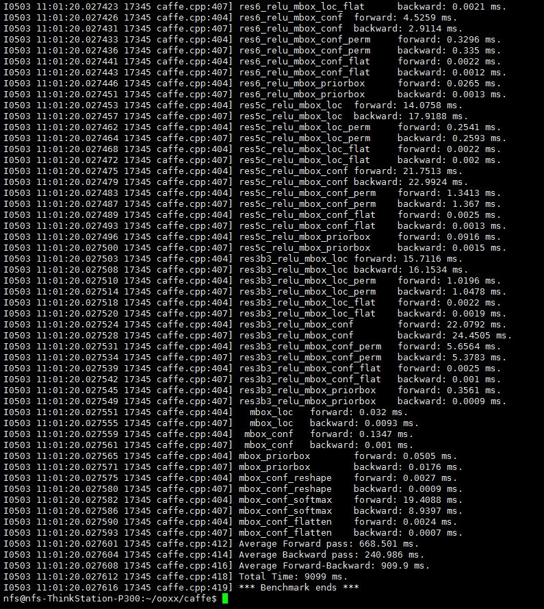

声明：本博客欢迎转发，但请保留原作者信息!                                      
作者: [曹文龙]                                                                 
博客： <https://cwlseu.github.io/>                                             

[TOC]

## 引言

最近跟小伙伴设计训练了很多模型，我们主要通过看`mAP`进行判断这个模型的好坏，没有将模型实际效果进行显示观察。这不，就想着写个调用的程序进行显示。

- 显示训练过程中的loss变化情况
- 显示训练过程中的lr变化情况
- 模型的inference time
- 模型效果的显示
本来想自己写，一看caffe里有类似的代码，真是太高兴了，先看看caffe是怎么做的。

## Caffe Tools中的demo 

### caffe
`caffe`可执行文件可以有不同的选项进行选择功能，功能选择是通过功能函数指针注册的方式实现的，在`tools/caffe.cpp`中有，其中的[注册功能部分](http://cwlseu.github.io/Cpp-Relearn)大家有兴趣可以学习一下，这块还是很有趣的。

### 分析train log
在`caffe/tools/extra`下有分析log的各种脚本，你可以使用`gnuplot`继续绘制，也可以采用python的`matplot`

1. 如果想提取log的关键信息，可以查看`parse_log.sh`或者`parse_log.py`

2. 如果想绘制采用绘制
`python tools/extra/plot_training_log.py 2 examples/ooxx/result/result.png jobs/ResNet/VOC0712/OOXX_321x321/ResNet_VOC0712_OOXX_321x321.log `

This script mainly serves as the basis of your customizations.
Customization is a must. You can copy, paste, edit them in whatever way you want. Be warned that the fields in the training log may change in the future. You had better check the data files and change the mapping from field name to field index in create_field_index before designing your own plots.

    Usage:
        ./plot_training_log.py chart_type[0-7] /where/to/save.png /path/to/first.log ...
    Notes:
        1. Supporting multiple logs.
        2. Log file name must end with the lower-cased ".log".
    Supported chart types:
        0: Test accuracy  vs. Iters
        1: Test accuracy  vs. Seconds
        2: Test loss  vs. Iters
        3: Test loss  vs. Seconds
        4: Train learning rate  vs. Iters
        5: Train learning rate  vs. Seconds
        6: Train loss  vs. Iters
        7: Train loss  vs. Seconds


### 显示模型结果
1. classification

```sh
./build/examples/cpp_classification/classification.bin \
  models/bvlc_reference_caffenet/deploy.prototxt \
  models/bvlc_reference_caffenet/bvlc_reference_caffenet.caffemodel \
  data/ilsvrc12/imagenet_mean.binaryproto \
  data/ilsvrc12/synset_words.txt \
  examples/images/cat.jpg
```

The output should look like this:

```cpp
---------- Prediction for examples/images/cat.jpg ----------
0.3134 - "n02123045 tabby, tabby cat"
0.2380 - "n02123159 tiger cat"
0.1235 - "n02124075 Egyptian cat"
0.1003 - "n02119022 red fox, Vulpes vulpes"
0.0715 - "n02127052 lynx, catamount"
```

2. ssd_detection
[ssd_detection脚本](https://github.com/cwlseu/caffe/blob/ssdplus/examples/stairsnet/ssd_detect_once.py)

3. stairsNet detection
[stairnet的结果展示脚本](https://github.com/cwlseu/caffe/blob/ssdplus/examples/stairsnet/stairsnet_detect.py)

其中需要配置一些依赖文件信息

```python
# caffe的root路劲
caffe_root=
labelmap_file = 'data/VOC0712/labelmap_voc.prototxt'
model_def = 'models/ResNet/VOC0712/OOXX_321x321/deploy.prototxt'
model_weights = 'models/ResNet/VOC0712/OOXX_321x321/ResNet_VOC0712_OOXX_321x321_iter_70000.caffemodel'
image_dir = "examples/ooxx/test"
save_dir = "examples/ooxx/result"
```

### 对多个snapshot模型进行打分
1. 首先运行模型自带的score脚本, 如`examples/ssd/score_ssd_pascal.py`，该脚本会调用当前最新的model进行评测，在jobs的子目录下生成一个XXXXX_score的路径，其中包含solver.prototxt等等文件。然后ctrl+C暂停运行。
2. 运行脚本[`model score script`](https://github.com/cwlseu/caffe/blob/ssdplus/tools/score_model.py)(先去玩几个小时，时间很漫长的...)，将会在jobs的某个路径下找到生成的各个模型对应的shell脚本和log文件。

### Inference Time
1. (These example calls require you complete the LeNet / MNIST example first.)
time LeNet training on CPU for 10 iterations
`./build/tools/caffe time -model examples/mnist/lenet_train_test.prototxt -iterations 10`
2. time LeNet training on GPU for the default 50 iterations
`./build/tools/caffe time -model examples/mnist/lenet_train_test.prototxt -gpu 0`
3. time a model architecture with the given weights on no GPU for 10 iterations
`./build/tools/caffe time --model=models/ResNet/VOC0712/OOXX_321x321/deploy.prototxt --weights models/ResNet/VOC0712/OOXX_321x321/ResNet_VOC0712_OOXX_321x321_iter_115000.caffemodel --iterations 10`


## Reference
1. [caffe]<https://github.com/cwlseu/caffe/tree/ssdplus>
2. [estimate Inference time from average forward pass time in caffe]<http://stackoverflow.com/questions/36867591/how-to-estimate-inference-time-from-average-forward-pass-time-in-caffe>
3. [caffe interface manual]<http://caffe.berkeleyvision.org/tutorial/interfaces.html>


