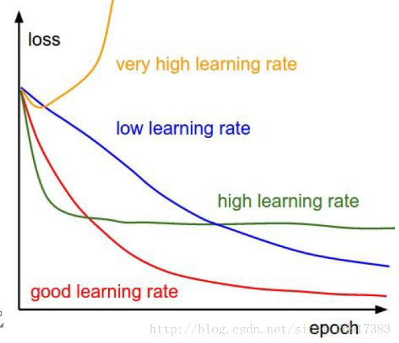

声明：本博客欢迎转发，但请保留原作者信息!                                      
作者: [曹文龙]                                                                 
博客： <https://cwlseu.github.io/>                                             

[TOC]

## 引言
在深度学习框架caffe的使用过程中，加深了对神经网络的理解，同时也将神经网络知识从理论落到实处。希望日后多多拿代码时间，将该总结继续增广~~

## 深度学习中常用的调节参数
### 学习率

步长的选择：你走的距离长短，越短当然不会错过，但是耗时间。步长的选择比较麻烦。步长越小，越容易得到局部最优化（到了比较大的山谷，就出不去了），而大了会全局最优。一般来说，如ResNet前32k步，很大，0.1；到了后面，迭代次数增高，下降0.01，再多，然后再小一些。 

### caffe训练时Loss变为nan的原因

#### 由小变大易出nan
**原因**：有小变大过程中，某个梯度值变得特别大，使得学习过程难以为继

例如：`10x10x256`的输入，输出如果是`20x20x256`或者`10x10x512`，如果是使用Inception-ResNet-v2或者直接进行卷积操作，很容易出现nan的情况。

> 具体解决方案：
- 参考[Inception的设计原则](http://cwlseu.github.io/Inception)重新设计网络
- 添加Batch normalization试试

#### 使用ResNet-Block或者Inception技术，最后的结果通过Bitwise Operation进行组合，而不是采用按channel Concatenate进行的。

> 尤其是BitWise multi进行组合的时候，往往会产生很大的数据悬殊，会导致梯度爆炸现象从而出现Loss 为nan

#### 梯度爆炸

**原因**：梯度变得非常大，使得学习过程难以继续

**现象**：观察log，注意每一轮迭代后的loss。loss随着每轮迭代越来越大，最终超过了浮点型表示的范围，就变成了NaN。

**措施**：
- 减小solver.prototxt中的`base_lr`，至少减小一个数量级。如果有多个`loss layer`，需要找出哪个损失层导致了梯度爆炸，并在train_val.prototxt中减小该层的`loss_weight`，而非是减小通用的`base_lr`。
- 设置`clip gradient`，用于限制过大的`diff`

#### 不当的损失函数

**原因**：有时候损失层中loss的计算可能导致NaN的出现。比如，给InfogainLoss层（信息熵损失）输入没有归一化的值，使用带有bug的自定义损失层等等。

**现象**：观测训练产生的log时一开始并不能看到异常，loss也在逐步的降低，但突然之间NaN就出现了。

**措施**：看看你是否能重现这个错误，在loss layer中加入一些输出以进行调试。
示例：有一次我使用的loss归一化了batch中label错误的次数。如果某个label从未在batch中出现过，loss就会变成NaN。在这种情况下，可以用足够大的batch来尽量避免这个错误。

#### 不当的输入

**原因**：输入中就含有NaN。

**现象**：每当学习的过程中碰到这个错误的输入，就会变成NaN。观察log的时候也许不能察觉任何异常，loss逐步的降低，但突然间就变成NaN了。

**措施**：重整你的数据集，确保训练集和验证集里面没有损坏的图片。调试中你可以使用一个简单的网络来读取输入层，有一个缺省的loss，并过一遍所有输入，如果其中有错误的输入，这个缺省的层也会产生NaN。

## Caffe Debug info
当我们训练过程面临nan, loss不收敛的情况，可以打开`solver.prototxt`中的`debuf_info:true`进行查错。

        I1109 ...]     [Forward] Layer data, top blob data data: 0.343971    
        I1109 ...]     [Forward] Layer conv1, top blob conv1 data: 0.0645037
        I1109 ...]     [Forward] Layer conv1, param blob 0 data: 0.00899114
        I1109 ...]     [Forward] Layer conv1, param blob 1 data: 0
        I1109 ...]     [Forward] Layer relu1, top blob conv1 data: 0.0337982
        I1109 ...]     [Forward] Layer conv2, top blob conv2 data: 0.0249297
        I1109 ...]     [Forward] Layer conv2, param blob 0 data: 0.00875855
        I1109 ...]     [Forward] Layer conv2, param blob 1 data: 0
        I1109 ...]     [Forward] Layer relu2, top blob conv2 data: 0.0128249
        . 
        .
        .
        I1109 ...]     [Forward] Layer fc1, top blob fc1 data: 0.00728743
        I1109 ...]     [Forward] Layer fc1, param blob 0 data: 0.00876866
        I1109 ...]     [Forward] Layer fc1, param blob 1 data: 0
        I1109 ...]     [Forward] Layer loss, top blob loss data: 2031.85
        I1109 ...]     [Backward] Layer loss, bottom blob fc1 diff: 0.124506
        I1109 ...]     [Backward] Layer fc1, bottom blob conv6 diff: 0.00107067
        I1109 ...]     [Backward] Layer fc1, param blob 0 diff: 0.483772
        I1109 ...]     [Backward] Layer fc1, param blob 1 diff: 4079.72
        .
        .
        .
        I1109 ...]     [Backward] Layer conv2, bottom blob conv1 diff: 5.99449e-06
        I1109 ...]     [Backward] Layer conv2, param blob 0 diff: 0.00661093
        I1109 ...]     [Backward] Layer conv2, param blob 1 diff: 0.10995
        I1109 ...]     [Backward] Layer relu1, bottom blob conv1 diff: 2.87345e-06
        I1109 ...]     [Backward] Layer conv1, param blob 0 diff: 0.0220984
        I1109 ...]     [Backward] Layer conv1, param blob 1 diff: 0.0429201
        E1109 ...]     [Backward] All net params (data, diff): L1 norm = (2711.42, 7086.66); L2 norm = (6.11659, 4085.07) 

At first glance you can see this log section divided into two: `[Forward]`  and `[Backward]`. Recall that neural network training is done via forward-backward propagation:
A training example (batch) is fed to the net and a forward pass outputs the current prediction. Based on this prediction a loss is computed. The loss is then derived, and a gradient is estimated and propagated backward using the chain rule.

### Caffe Blob data structure
Just a quick re-cap. Caffe uses Blob data structure to store data/weights/parameters etc. For this discussion it is important to note that `Blob` has two "parts": `data` and `diff`. The values of the Blob are stored in the data part. The diff part is used to store element-wise gradients for the backpropagation step.

### Forward pass

You will see all the layers from bottom to top listed in this part of the log. For each layer you'll see:

        I1109 ...]     [Forward] Layer conv1, top blob conv1 data: 0.0645037
        I1109 ...]     [Forward] Layer conv1, param blob 0 data: 0.00899114
        I1109 ...]     [Forward] Layer conv1, param blob 1 data: 0

Layer "conv1" is a convolution layer that has 2 param blobs: the filters and the bias. Consequently, the log has three lines. The filter blob (param `blob 0`) has data

        I1109 ...]     [Forward] Layer conv1, param blob 0 data: 0.00899114

That is the current L2 norm of the convolution filter weights is 0.00899.
The current bias (param `blob 1`):

        I1109 ...]     [Forward] Layer conv1, param blob 1 data: 0

meaning that currently the bias is set to 0.

Last but not least, "conv1" layer has an output, "top" named "conv1" (how original...). The L2 norm of the output is

        I1109 ...]     [Forward] Layer conv1, top blob conv1 data: 0.0645037

Note that all L2 values for the [Forward] pass are reported on the data part of the Blobs in question.

### Loss and gradient
At the end of the [Forward] pass comes the loss layer:

        I1109 ...]     [Forward] Layer loss, top blob loss data: 2031.85
        I1109 ...]     [Backward] Layer loss, bottom blob fc1 diff: 0.124506

In this example the batch loss is 2031.85, the gradient of the loss w.r.t. `fc1` is computed and passed to `diff` part of fc1 Blob. The L2 magnitude of the gradient is 0.1245.

### Backward pass
All the rest of the layers are listed in this part top to bottom. You can see that the L2 magnitudes reported now are of the diff part of the Blobs (params and layers' inputs).

### Finally
The last log line of this iteration:

        [Backward] All net params (data, diff): L1 norm = (2711.42, 7086.66); L2 norm = (6.11659, 4085.07)

reports the total L1 and L2 magnitudes of both data and gradients.

### What should I look for?

- If you have nans in your loss, see at what point your data or diff turns into nan: at which layer? at which iteration?
- Look at the gradient magnitude, they should be reasonable. IF you are starting to see values with e+8 your data/gradients are starting to blow off. Decrease your learning rate!
- See that the diffs are not zero. Zero diffs mean no gradients = no updates = no learning.

## reference

1. [caffe︱深度学习参数调优杂记+caffe训练时的问题+dropout/batch Normalization](http://www.cnblogs.com/maohai/p/6453417.html)
2. [Common causes of nans during training](http://stackoverflow.com/questions/33962226/common-causes-of-NaNs-during-training)
3. [Caffe debug info 的使用](http://stackoverflow.com/questions/40510706/how-to-interpret-caffe-log-with-debug-info)