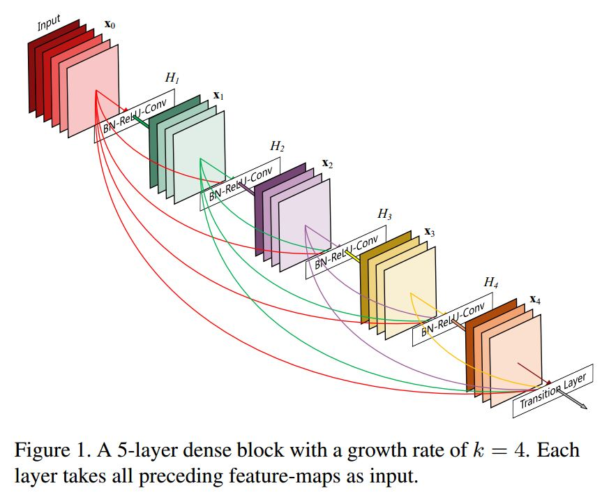
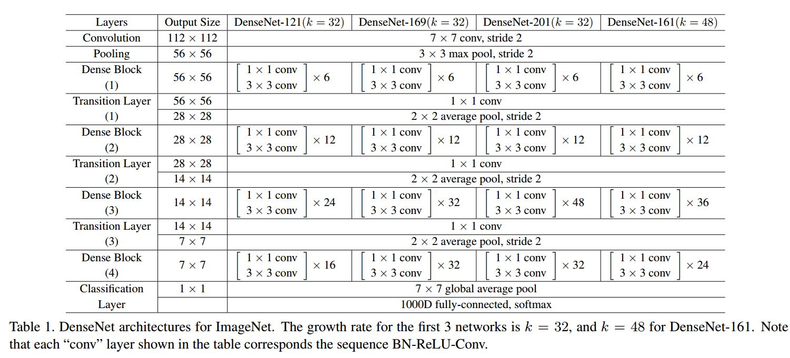

声明：本博客欢迎转发，但请保留原作者信息!                            
作者: [曹文龙]                                                                 
博客： <https://cwlseu.github.io/>

## 文章来源

[arxiv](https://arxiv.org/abs/1608.06993)          
[torch代码地址](https://github.com/liuzhuang13/DenseNet)           
[caffe模型地址](https://github.com/shicai/DenseNet-Caffe)                         

## 突出贡献

In this paper, we propose an architecture that distills this insight into a simple connectivity pattern: to ensure maximum information flow between layers in the network, we connect all layers (with matching feature-map sizes) directly with each other. To preserve the feed-forward nature, each layer obtains additional inputs from all preceding layers and passes on its own feature-maps to all subsequent
layers. Crucially, in contrast to ResNets, we never combine features
through summation before they are passed into a layer; instead, we combine features by concatenating them.

## 模型

对其中的121层的模型进行显示，如下图所示。为了显示得更多，我对其中第二个DenseBlock变为只剩头和尾的部分，第三层的也是如同处理。

### 残差网关键技术
关键是ResBlock的理解。传统卷积网络就是l层向前卷积，结果作为l+1层的输入。ResNet中添加了一个skip-connnection连接l层和l+1层。如下共计算公式：

### 稠密网关键技术

### Growth rate
稠密网中的每个denseblock单元中，每层产生特征的个数为k的话，那么第l层将有kx(l-1) + k0个输入特征。

## 效果
DenseNet有如下优点： 
1.有效解决梯度消失问题 
2.强化特征传播 
3.支持特征重用 
4.大幅度减少参数数量

## 想法

1. 其实无论是ResNet还是DenseNet，核心的思想都是HighWay Nets的思想： 
就是skip connection,对于某些的输入不加选择的让其进入之后的layer(skip)，从而实现信息流的整合，避免了信息在层间传递的丢失和梯度消失的问题(还抑制了某些噪声的产生).

2. 利用DenseNet block实现了将深度网络向着浅层但是很宽的网络方向发展。