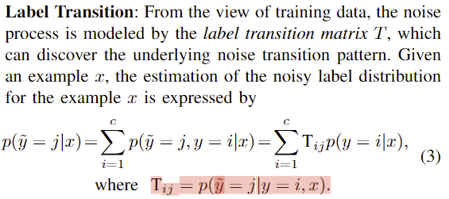
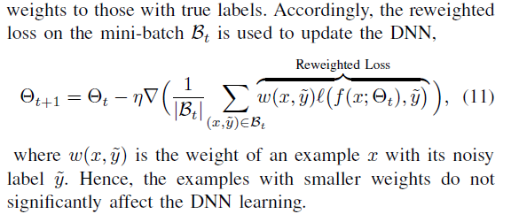
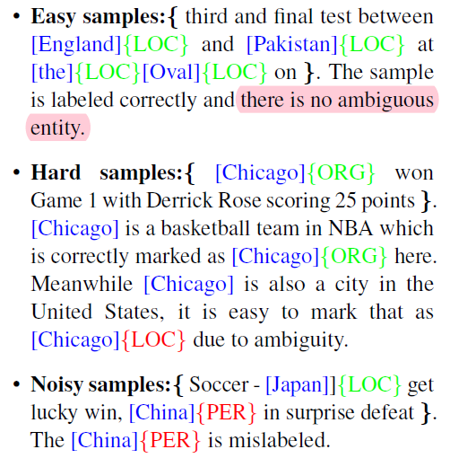
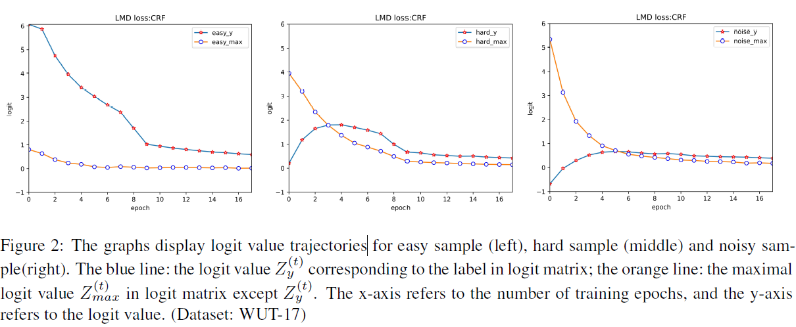
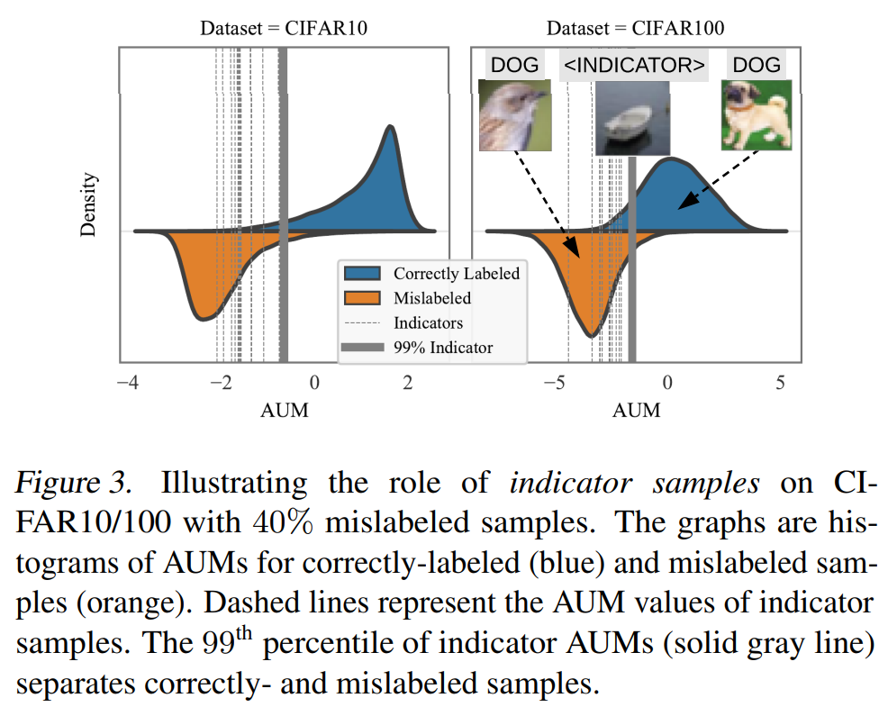
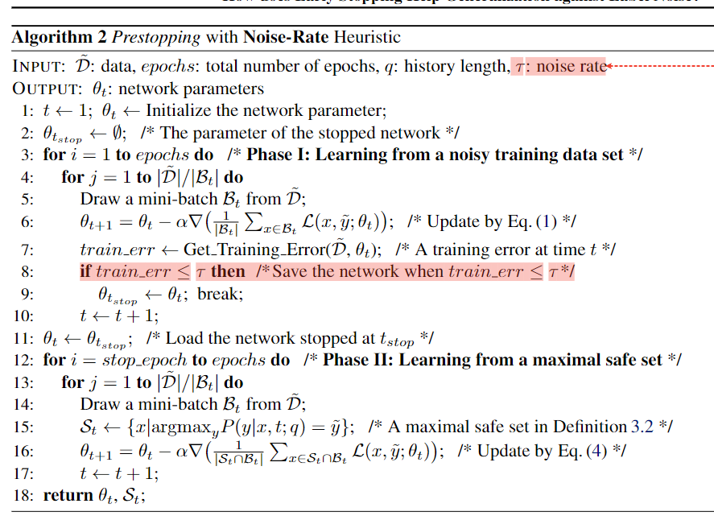

# Label Noise Learning

@(NLP)[噪声, 主动学习]

[TOC]

## 序言
过参数化在深度学习时代常常被提到，它的神经网络参数个数甚至超过了 training sample 的个数，在实验中也体现出了非常好的效果。但是，一旦training samples中带有一些噪声，整个模型就趋向于过拟合，没有办法很好地泛化到测试集。一般而言，training samples带噪声的方式有两种，一是在 data points上加 Gaussian noise，二是 label noise.  我们这里主要探究第二种。

### 存在噪声标注数据
诸如数据增强、权重衰减、dropout和批量归一化等流行的正则化技术已经被广泛应用，但是它们本身并不能完全克服在噪声数据上过拟合问题。
1、噪声的类别
(1) `instance-independent label noise`: 现有大部分算算法都是针对这种类型的带噪数据进行的研究建模的，因为instance-dependent 建模比较复杂。
-  symmetric noise: 一个标签标错为其他类别的标签概率一样
-  asymmetric noise: 一个标签标错为其他类别的标签概率不一样
-  pair noise: 一个标签只会错标为对应的另外一种标签, 标错的是在这些标签对形式存在(a, b)

(2) `instance-dependent label noise`
2、困难
（1）深度学习模型因为其高阶的表达方式，更容易受到label noise的影响。

3、要获得一个鲁棒性的模型，方法可以大致分为三类：
（1）设计使用好的损失函数
（2）训练方式: Training architectures methods
（3）减少错误标注: Label correction methods. 噪声数据比重占比在8.0% ~38.5%范围内。

4、常用概念

**Label Transition**

**Memorization Effect**

结果表明，DNN的权值在训练开始时仍保持在初始权值附近，在对noise label过度拟合时开始偏离初始权值很远，这一现象也被称为DNN的记忆效应，即DNN倾向于首先学习简单和概括的模式，然后逐渐过度适应所有的噪声模式。因此，为了实现更好的泛化，通常采用提前停止和偏爱小损失训练实例来设计健壮的训练方法
**Risk Minimization**

一般采用经验风险最小化的迭代优化如下，而在非clean的dataset上直接使用该优化方法，将在泛化数据集上测试结果退化。

一般情况下通过优化过程中降低或者屏蔽噪音sample影响以实现缓解退化的问题。

***

## 1、NAF

- paper: Named Entity Recognition via Noise Aware Training Mechanism with Data Filter（ACL-IJCNLP 2021 Findings）
- 论文链接：https://aclanthology.org/2021.findings-acl.423.pdf

#### 问题定义
区分难样本和噪声样本仍然是一个挑战，特别是在过拟合的情况下变得更具挑战性。
存在歧义的hard sample与noise sample是比较难以分开的，因为hard sample在训练初期也是具有较大loss的。

#### Logit-Maximum-Difference (LMD) mechanism
（0）一般我们是NN之后的logist矩阵加softmax和损失，由于softmax是归一化的指数函数，这就使得logist矩阵中的值的变化不是通过线性变化反映出来，这给我们识别noise sample带来了不公平。

（1）上图中需要注意的是，noise sample的情况下，相对差距比较其他两类：hard/easy sample 较小。

$$LMD(x, y) = \frac{1}{T}\sum^T_{t=1}(min(Z_y^{(t)} - max_{i!=y}Z_i^{(t)}))$$

（2）训练过程中，刚开始几个epoch，模型总是倾向于学习正确的样品。这意味着即使有些样本即使贴上了错误的标签，模型仍然可以预测正确的结果。随着训练epoch过长，会出现overfitting的问题。如上图所示，在hard和noise sample 中训练发现损失趋于一致。这就是在noise sample中overfitting的一种现象。

#### noise tolerant term named Distrust-Cross-Entropy(DCE)
（0）主要想法
- 在CRF的损失函数中添加DCE 项，用来平衡是否接受模型输出还是标注
- 超参数$\delta$越大，则越相信预测结果

（1）预测结果的分布
$$
\begin{align*}
 p &= p(k\mid x)     \\
\end{align*}
$$
（2）标注结果分布是one-hot的分布，分布如下
$$
\begin{align*}
q &= q(k\mid x)      \\
\end{align*}
$$
（3）则应用KL散度可以衡量预测与实际输出的分布差异。
$$
\begin{align*}
KL(q\mid\mid p)&= H(q, p) - H(q) \\ 
\end{align*}
$$
（4）通过在基本损失函数基础上，引入DCE项，来
$$
\begin{align*}
L_{DCE} &= - plog(\delta p+(1- \delta)q) \\
L_{In\_trust} &= \alpha L_{CRF}+\beta L_{DCE} 
\end{align*}
$$

> 结论

通过分析发现，$\delta$越大，那么就通过输出结果$p$学习，$\delta$越小，就通过$q$学些。
> We observe that when  is larger, the model tends to learn from the p of the model output, and when is smaller, the model tends to learn from the label q

> 小结: 该方法通过分析难例与噪声标注之间的差异，添加额外项优化损失函数，减少noise label对模型优化的影响。

***
## 2、AUM

- paper: Identifying mislabeled data using the area under the margin ranking

首先通过经验角度分析提出的noise label与hard label之间的差异，得出经验判别条件。

Margin的定义如下所示，其中t代表是第t个epoch，x代表是输入的数据，y代表annotation labe，z代表的是最终prediction的logits。由式子定义可知其可能会去到负数，当为负数的时候，代表模型预测的结果可能和真值结果存在不同，因此当前样本可能是噪声。
$$M^{t}(x,y) = z^{t}_{y}(x) - max_{i != y}z^{t}_{i}(x)$$
考虑到不同epoch margin值可能是不一样的，因此作者定义了如下所示的AUM值，它相当于对前T个epoch的Margin值计算了平均。
$$AUM(x, y) = \frac{1}{T}\sum_{t=1}^T{M^t(x,y)}$$

AUM值越小代表这个样本越有可能是噪声数据，但是只根据ranking是没有办法得到一个绝对的划分。因此需要一个绝对的划分。

作者提出使用threshold samples，作者从训练集合中抽样一部分数据出来作为threshold samples，这部分数据会人为的指定噪声标签，并且加入训练。最终这部分数据的AUM前从高到底排序的90分位值即可以作为AUM的阈值，用于划分噪声数据和非噪声数据。

> 该方法通过最大化margin的角度，减少噪声的影响。 

## 3、早停

- paper: Hwanjun Song, Minseok Kim, Dongmin Park, & Jae-Gil Lee (2019). How does Early Stopping Help Generalization against Label Noise arXiv: Learning.
- 链接地址: https://ui.adsabs.harvard.edu/link_gateway/2019arXiv191108059S/arxiv:1911.08059

探究了`Best point to early stop`与`Criterion of a maximal safe set`
1、Best point to early stop
- Validation Heuristic: 准备一个干净的验证集$\mathcal{V}$

- Noise-Rate Heuristic: 需要知道数据集的噪声率$\tau$， 但是在真实业务场景不容易获得。

2、Criterion of a maximal safe set

> 该方法挖掘cleandata进行训练，规避noise label数据对模型的影响

***

## 4、SOP

- github: https://github.com/shengliu66/SOP
- paper: Robust Training under Label Noise by Over-parameterization

这篇文章的思路其实并不复杂，我们需要在原有模型的基础上，对于每一个数据点增加一个 variable $s_i$，它代表该数据点的 label noise，最后的目标函数就是

其中，由于这个noise是具有sparse性质的，因此作者们沿用了先前若干文章中的技巧，采用了一种特殊的参数化方式： $s_i = u_i \odot u_i - v_i \odot v_i$
，当然其中还需要规定一下 $u_i, v_i$的取值范围，最终的优化问题是：

## 5、小结

- hard sample与noise label sample是我们这块更关注的，但是这对难兄难弟又杂糅在一起，本文中多篇文章中对二者差异进行了经验结果分析，这个对于我们在实际业务数据上实验的时候可以提供一些思路。例如难例挖掘是不是就可以考虑利用这个特点？
- 如果业务数据中有噪声，可以考虑清理一个干净的validate dataset。训练过程中的一些测评结果，对于评估模型设计是否合理，数据是否干净还是比较有用的。但是可能因为交付时间等外部原因，我们往往忽略这些中间结果。
- 这一块除了早停或者清洗验证集之外，还有就是训练时候能够将损失函数将noise label的数据权重降低，而标样本的权重高一些。

***

## 关于noise label更多文献

### 矫正noise样本
> Hwanjun Song, Minseok Kim, & Jae-Gil Lee (2019). SELFIE: Refurbishing Unclean Samples for Robust Deep Learning International Conference on Machine Learning.

我们的核心思想是有选择地更新和利用可高精度校正的不干净样本，从而逐步增加可用训练样本的数量

### 关于Noisy labels learning的综述

> Hwanjun Song, Minseok Kim, Dongmin Park, & Jae-Gil Lee (2020). Learning from Noisy Labels with Deep Neural Networks: A Survey arXiv: Learning.

通过有监督的学习使得模型对于有噪声的标签具有更好的鲁棒性。鲁棒损失函数和损失调整是为了修改损失函数或其损失值；鲁棒结构是为了更改体系结构以对噪声数据集的噪声转换矩阵进行建模；鲁棒正则化是为了使DNN减少对错误标记样本的过度拟合；样本选择是为了从带有噪声的训练数据中识别出带有真实标签的样本。除了监督学习之外，研究人员最近还尝试通过采用元学习和半监督学习来进一步提高噪声鲁棒性。

### 其他资料
- https://github.com/songhwanjun/Awesome-Noisy-Labels
- https://github.com/subeeshvasu/Awesome-Learning-with-Label-Noise
-  Open-set Label Noise Can Improve Robustness Against Inherent Label Noise
-  Song, H., Kim, M., and Lee, J.-G. SELFIE: Refurbishing unclean samples for robust deep learning. In ICML, pp.5907–5915, 2019.
-  Han, B. ,  Yao, Q. ,  Liu, T. ,  Niu, G. ,  Tsang, I. W. , &  Kwok, J. T. , et al. (2020). A survey of label-noise representation learning: past, present and future. https://arxiv.org/pdf/2011.04406v1.pdf
