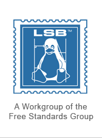
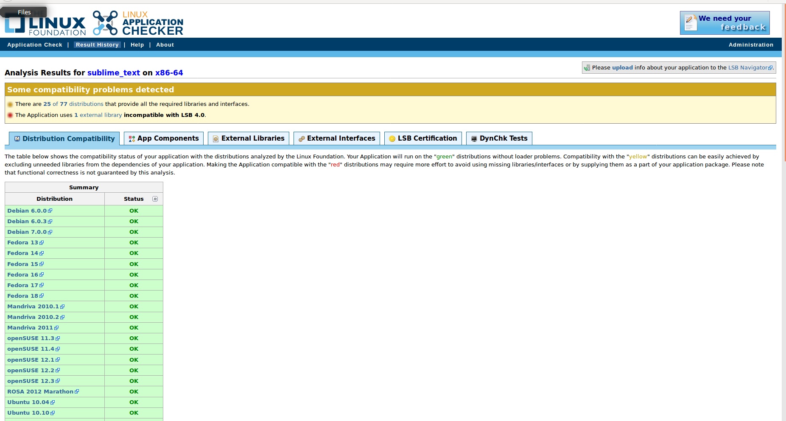
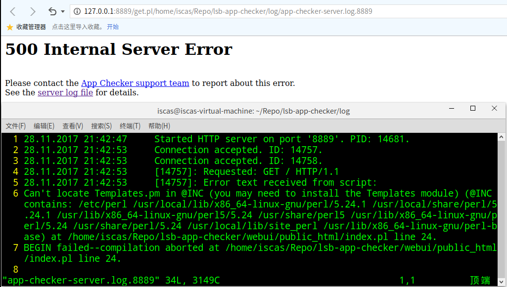
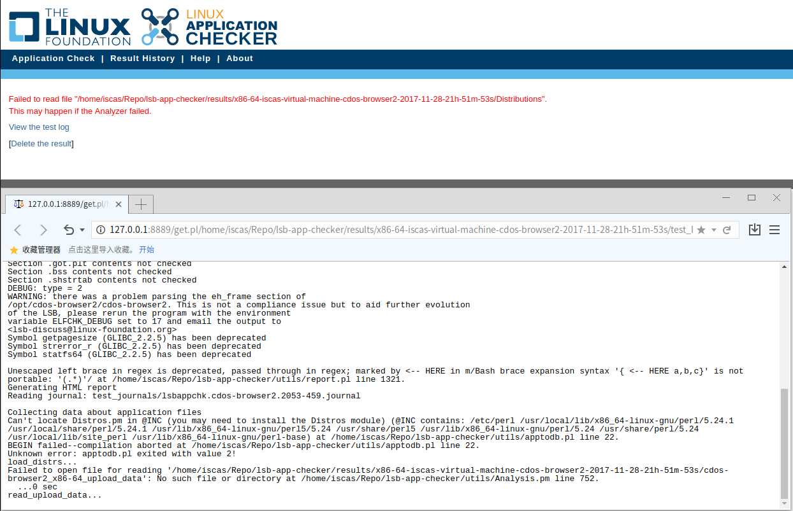

## Unix/Linux 标准化历史

标准化目前已经成为 Linux 系统上的一个热门话题。实际上，在 Linux 诞生之初，这个问题就得到了重视。当 Linus 在开发 0.01 版本的 Linux 内核时，就开始关注 `POSIX` 标准的发展，他在 `/include/unistd.h` 文件中定义了几个与 `POSIX` 有关的宏，以下内容就节选自 0.01 版本内核的 `/include/unistd.h` 文件：
```c
/* ok, this may be a joke, but I'm working on it */
#define _POSIX_VERSION 198808L
```
下面我们就从 POSIX入手开始介绍 Unix/Linux 方面的标准化发展历程。

### POSIX

Unix 1969 年诞生于 AT&T 贝尔实验室，并在 1973 年使用 C 语言进行了重写，从此就具有了很好的可移植性。但是当 AT&T 在 1984 年由于分拆而得以进入计算机领域的市场之后，却引发了 Unix 业界的一场大战。当时最为主要的两个版本是 AT&T 的 System V 和伯克利的 BSD。二者在技术方面（例如终端）和文化方面都存在很多分歧，导致应用程序很难在不同的系统上平滑地进行移植，为了解决这个问题，IEEE（Institute of Electrical and Electronic Engineers）的 1003 委员会着手开发了一系列标准，这就是后来的 `POSIX`（Portable Operating System Interface for UNIX）标准。其目的是为那些兼容各种 UNIX 变种的应用程序制定应用程序编程接口（API）规范，从而确保这些应用程序的兼容性。这些标准后来被 ISO/IEC 采纳，成为 ISO/IEC 9945 标准。

`POSIX` 在 15 份不同的文档中对操作系统与用户软件的接口进行了规范，主要内容包括3个部分：
* POSIX 系统调用
* POSIX 命令和工具
* POSIX 兼容测试
同时还提供了一套 POSIX 兼容性测试工具，称为 PCTS（POSIX Conformance Test Suite）。

后来 `POSIX` 标准又进行了很多扩充，主要包括：
1. POSIX.1，核心服务：主要集成了 ANSI C 标准，包括进程创建和控制、信号、浮点异常、段错误、非法指令、总线错误、定时器、文件和目录操作、管道、C 标准库、I/O 端口和控制
2. POSIX.1b，实时扩展：包括优先级调度、实时信号、时钟和定时器、信号量、消息传递、共享内存、异步和同步 I/O、内存锁
3. POSIX.1c，线程扩展：包括线程创建和控制、线程调度、线程同步、信号处理

`POSIX` 最初的设计目标是为 Unix System V 和 BSD Unix 等 Unix 系统上的特性制定规范，使其可以实现更好的可移植性。但是很多其他系统都也兼容`POSIX` 标准。例如，微软的 Windows NT 就兼容 `POSIX` 标准的实时部分（POSIX.1b），而 RTOS（LynxOS real-time operating system）也与 `POSIX` 标准兼容。Windows 上可以通过安装 Windows 的 Services for UNIX 或 Cygwin 来增强对 `POSIX` 标准的兼容度。

### Open Group

Open Group 是现在 Unix 商标的拥有者，其前身是 X/Open。X/Open 是 Unix 厂商在 1984 年成立的一个联盟，它试图为众多 Unix 变种定义一个安全公共子集，因此即使在 Unix 混战的年代，也得到了比较好的发展。在 1993 年，包括主要 Unix 公司在内的75 家系统和软件供应商委托 X/Open 为 Unix 制定一个统一的规范。X/Open在现有标准基础上，增加了对终端进行处理的 API 和 X11 API，并全面兼容 1989 ANSI C 标准，最终诞生了第一版本的单一 Unix规范（Single Unix Specification，简称 SUS）。
X/Open在 1996 年与 OSF（开放软件基金会）进行合并，成立了 Open Group 组织，专门从事开放标准的制定和推广工作，并对很多领域提供了认证，包括 Unix 操作系统、Motif 和 CDE（Common Desktop Environment）用户界面。
Austin Group
Austin Group 是在 1998 年成立的一个合作技术工作组，其使命是开发并维护 POSIX.1 和 SUS 规范。Austin Group 开发规范的方法是"write once, adopt everywhere"，即由 Austin Group 制定的规范既会成为 IEEE POSIX 规范，又会成为 Open Group 的 技术标准规范，以后又会被采纳为 ISO/IEC 的标准。新开发的规范后来就被标准化为 ISO/IEC 9945 和IEEE Std 1003.1，并成为 SUSV3 的核心部分。
这种独特的开发模式最大限度地利用了业界领先的工作成果，将正式的标准化工作转化成了一个唯一的行为，并且吸引了广泛的参与者。Austin Group 目前有 500 多个参与者，工作组的主席是 Open Group 的 Andrew Josey。

### LSB

在90 年代中期，Linux 也开始了自己的标准化努力。实际上，Linux 一直都试图遵守 `POSIX` 标准，因此在源代码级上具有很好的兼容性，然而对于 Linux 来说，仅仅保证源码级的兼容性还不能完全满足要求：在 Unix 时代，大部分系统都使用的是专有的硬件，软件开发商必须负责将自己的应用程序从一个平台移植到其他平台上；每个系统的生命周期也很长，软件开发商可以投入足够的资源为各个平台发布二进制文件。然而 Linux 使用的最广泛的 x86 通用平台，其发行版是如此众多，而发展却如此之快，软件开发商不可能为每个发行版都发布一个二进制文件，因此就为 Linux 上的标准化提出了一个新的要求：二进制兼容性，即二进制程序不需要重新编译，就可以在其他发行版上运行。
实际上，在 Linux 社区中第一个标准化努力是文件系统层次标准（Filesystem Hierarchy Standard，FHS），用来规范系统文件、工具和程序的存放位置和系统中的目录层次结构，例如 ifconfig 命令应该放在 `/usr/bin` 还是 `/usr/sbin` 目录中，光驱应该挂载到 `/mnt/cdrom` 中还是 `/media/cdrom` 中。这些需求最终共同促进了 Linux Standard Base（LSB）项目的诞生。
LSB目前是 FSG（Free Standards Group）中最为活跃的一个工作组，其使命是开发一系列标准来增强 Linux 发行版的兼容性，使各种软件可以很好地在兼容 LSB 标准的系统上运行，从而可以帮助软件供应商更好地在 Linux 系统上开发产品，或将已有的产品移植到 Linux 系统上。

LSB 以 `POSIX` 和 SUS 标准为基础，并对其他领域（例如图形）中源代码的一些标准进行了扩充，还增加了对二进制可执行文件格式规范的定义，从而试图确保 Linux 上应用程序源码和二进制文件的兼容性。

##	LSB简介

LSB是Linux Standard Base取首字母的缩写。LSB的目标是制定标准提高Linux系统与其他相似系统的兼容性。LSB标准定义了二进制环境，符合LSB的应用程序在其中可以可以在其中运行。LSB 是 Linux 标准化领域中事实上的标准，它的图标（请参看图 1）非常形象地阐述了自己的使命：对代表自由的企鹅（Linux）制定标准。给定企鹅的体形和三维标准之后，软件开发者就可以设计并裁减出各色花样的衣服（应用程序），这样不管穿在哪只企鹅身上，都会非常合身。



在现有标准基础上，LSB 制定了应用程序与运行环境之间的二进制接口，这主要是基于以下标准：
1. Single UNIX Specification（SUS）
2. System V Interface Definition（SVID）
3. compilers for the Intel Itanium processor
4. C++ ABI
5. System V Application Binary Interface（ABI）

同时，LSB 充分吸取了 UNIX 标准化努力所取得经验和教训，回避了这些标准的一些问题。例如，`POSIX` 仅仅定义了编程接口的标准，但是它却无法保证二进制的兼容性。而诸如 OSF/1 之类的标准虽然试图解决二进制兼容性的问题，但是限制却太为严格。LSB 在二者之间达成了一个平衡，它包含了一个二进制兼容层，同时消除了 `POSIX` 与 OSF/1 之间存在分歧的地方。
LSB 对各个库提供的接口以及与每个接口相关的数据结构和常量进行了定义，图2给出了 LSB 3.1 环境中所包含的组件。这些组件包括开发者所需要的共享库（包括 C++），文件系统层次结构（FHS）、对象文件格式、命令和工具、应用程序包、用户和组、系统初始化等所采用的规范：


## 	LSB发展的路线图

　 　LSB 项目最初发起于 1998 年 5 月，其项目启动宣言得到了 Linus Torvalds、Bruce Perens、Eric Raymond 等人的签名支持，当时的目标是建立一系列构建 Linux 发行版所采用的源代码应该遵循的标准，并提供一个参考平台。
* 2000 年 5 月，LSB 成为 Free Standards Group（FSG） 的一个工作组，全面负责LSB计划。FSG 是一个独立的非盈利组织，专注于通过开发和促进标准来加速开源软件的发展。
* 2001年7月4日，LSB 1.0发布，迈出了Linux标准化道路上重要的一大步。LSB 1.0的规范仅包括了通用LSB（LSB Common）1.0.0。
* 2002年2月4日，在美国召开的LinuxWorld大会上，HP、IBM、拓林思、SuSE、Red Hat、Caldera和Ximian公司联合发布了LSB 1.1。LSB 1.1对Linux核心功能和一些组件进行了标准化。它包括一组公共API、一个开发包和一些测试功能。LSB 1.1在1.0的基础上增加了对IA32架构处理器的支持，规范包括通用LSB 1.1.0和IA32处理器专用规范（LSB IA32）1.1.0。LSB 1.2 LSB 1.2包括了通用LSB规范及对IA32、IA64和PPC32架构处理器的专用规范。LSB 1.3 LSB 1.3在1.2的基础上又增加了对IBM S/390和S/390X的支持。规范包括通用LSB 1.3、LSB IA32 1.3、LSB IA64 1.3、LSB PPC32 1.3、LSB S390 1.3和LSB S390X 1.3。
* 2004年9月14日正式发布LSB 2.0。其最大特点是增加了对C++的二进制接口。2004年10月21日，LSB 2.0.1发布。
* 2005年7月1日， LSB 3.0发布。LSB 3.0更新了原来版本的一些基本规范和执行，特别是SUS（Single Unix Specification，单一Unix规范）的升级。以SUS 3.0为基础。SUS 3.0同时也是IEEE 1003 1-2001标准（POSIX）和ISO/IEC 9945:2003标准。LSB 3.0中最重要的是文档的重构和LSB上层附加标准的发展。文档重构的目的是推动LSB未来的发展。LSB 3.0中另一个重要的新特点是引入了对POSIX线程和C++应用的支持，它增加了C++的应用二进制接口（ABI），用于改善代码互用性。 这一特点意义重大，因为现在的大多数应用都是用C++编写，通过在LSB中加入C++支持，使数以千计的软件开发商能以较低成本将他们的应用移植到 Linux上，由此带来Linux应用软件数量上的突飞猛进。LSB 3.0的文档结构是附加规范模块的根基，这些附加规范模块在核心LSB规范（Core LSB Specification）之上。这些新模块允许新功能的增加，其中一些功能甚至是被认为在LSB范围之外的。 新模块还允许LSB以外的组织通过使用 LSB确定的框架来添加新功能。LSB 3.0.0 标准文档，LSB标准发展到了3.0，结构与2.0一样。LSB 3.0 基于新的C++ 二进制接口，还有其他的改进。另外还包括PAM和FHS 2.3。，以及包括加入gcc3.4，librt，一些新功能和新接口以及新命令等。
* LSB 3.1 版本的规范主要是增强了对桌面系统的标准化支持，增加了对 GTK 和 QT GUI 工具包的标准化。另外，LSB 还调整了自己的路线图，以便可以与主流的 Linux 发行商（Redhat、Novell、Asianux、Debian 等）的发行计划更好地吻合，并吸引了更多 Linux 发行商的参与，对开发工具和文档进行了改进，还与各个国家的组织（例如中国电子技术标准化研究所，CESI）进行认证方面的合作。截止到3.1版本，该规范可以支持 7 种体系结构：
    - IA32
    - IA64
    - X86_64
    - PPC32
    - PPC64
    - S390
    - S390x

* LSB 4.0 在 2008 年发布，它将实现更好的二进制兼容性，并增加对 Perl、Python、LAMP、Java 等语言的标准化支持。详细路线图及各个主要版本的特性如图 3 所示：
 


* LSB 5.0 was released June 3, 2015

## 在Linux上的测试结果

### ubuntu 16.04

1. 下载`https://ftp.linuxbase.org/pub/lsb/bundles/released-5.0.0/app-testkit/lsb-app-checker-5.0.0-3.x86_64.tar.gz` 

2. 运行`./lsb-app-checker/bin/app-check-start.pl`





在ubuntu16.04上安装正常，使用正常。

### CDOS上安装失败，出现500 Internal Server Error

1. 安装lsb和lsb-core

2. lsb-app-checker访问错误1

后面经过几番折腾，已经fix掉。开始使用进行application LSB标准检测吧。结果出现如下问题：



## 二次开发

未完待续...

## 参考文献

[1]. LSB 5.0 Specifications Archive:  http://refspecs.linuxbase.org/LSB_5.0.0/allspecs.shtml	

[2]. LSB 4.1 Release Notes https://wiki.linuxfoundation.org/lsb/lsb-41-release-notes

[3]. LSB 下载：https://www.linuxbase.org/download/

[4]. ISO/IEC 23360 Spec文档下载链接，点击I accept: 
http://standards.iso.org/ittf/PubliclyAvailableStandards/c043781_to_043788_ISO_IEC_23360_2006_LSB.zip

[5]. LSB简介：https://www.ibm.com/developerworks/cn/linux/l-lsb-intr/index.html

[6].有关 Open Group 以及相关标准的介绍，http://www.opengroup.org/ 

[7]. Free Standards Group（FSG）及其主持的项目的信息：http://www.freestandards.org 

[8].Austin Group 的更多信息 http://www.opengroup.org/austin/

[9].Unix 的发展历史和标准化努力，请参考Eric S. Raymond 撰写的"The Art of Unix Programming"一书（http://www.faqs.org/docs/artu/index.html

[10]. History and Timeline （http://www.unix.org/what_is_unix/history_timeline.html