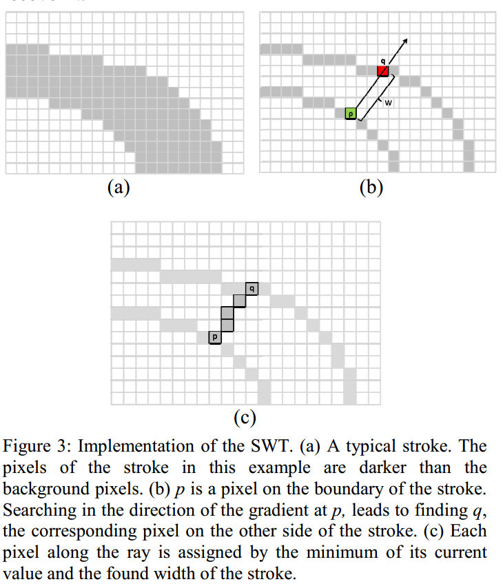
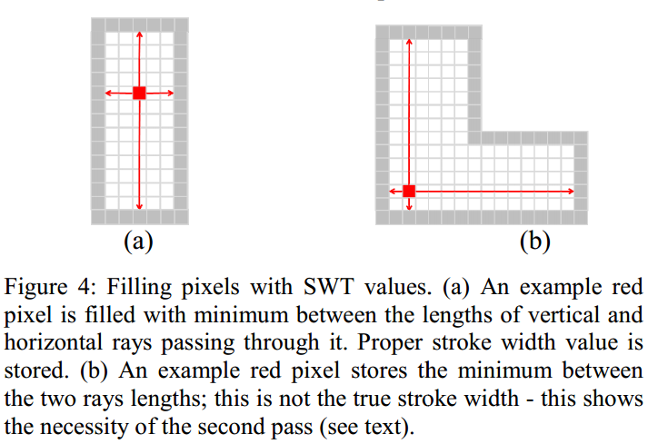

* content
{:toc}

## 定义
the process of predicting the presence of text and localizing each instance (if any), usually at word or line level, in natural scenes
<!-- the process of converting text regions into computer readable and editable symbols -->
传统光学字符识别主要面向高质量的文档图像，此类技术假设输入图像背景干净、字体简单且文字排布整齐，在符合要求的情况下能够达到很高的识别水平。
与文档文字识别不同，自然场景中的文字识别：
* 图像背景复杂
* 分辨率低下
* 字体多样
* 分布随意等
现在我们只想单纯地想对字符进行识别，可以采取的策略：
* 使用谷歌开源OCR引擎Tesseract(需要对tesseract整理)
* 使用大公司的OCR开放平台（比如百度），使用他们的字符识别API(不适合商业应用)
* 传统方法做字符的特征提取，输入分类器，得出OCR模型
* 暴力的字符模板匹配法(计算量不小)
* 大杀器：基于深度学习下的CNN字符识别

## Tesseract源码分析

# 经典算法

## SWT算子
- [Detecting Text in Natural Scenes with Stroke Width Transform](http://cmp.felk.cvut.cz/~cernyad2/TextCaptchaPdf/Detecting%20Text%20in%20Natural%20Scenes%20with%20Stroke%20Width%20Transform.pdf)
- github: https://github.com/aperrau/DetectText

https://blog.csdn.net/liuxiaoheng1992/article/details/85305871

下面根据原文的结构和上述提供的代码详细的解读一下该算法。

总的来说该算法分为四步：
* 利用canny算子检测图片的边界
* 笔画宽度变换-Stroke Width Transform（这一步输出的图像我们称为SWT图像）
* 通过SWT图像得到多个连通域
* 通过自定义的规则过滤一些连通域，得到候选连通域
* 将连通域合并得到文本行

#### 利用canny算子检测图片的边界
这步不用多说，基础的图像处理知识，利用OpenCV 的Canny函数可以得到图片边缘检测的结果。

#### 笔画宽度变换（Stroke Width Transform）
这一步输出图像和输入图像大小一样，只是输出图像像素为笔画的宽度，具体如下。


如上图所示，通过边缘检测得到上图a，假设现在从边缘上的点p开始，根据p点梯度的反方向找到边缘另一边的点q，如果p点的梯度与q点梯度的反方向夹角在$\pm\pi/6$之间，那么这两点间的距离为一个笔画宽度，那么p点和q点以及它们之间的像素在SWT输出图像中对应位置的值为p和q点的距离大小。

按照上述的计算方法会有两种情况需要考虑。如下图所示，



下图a表示一个笔画中的像素可能得到两个笔画宽度，这种情况下将红点出的笔画宽度设置为最小的那个值，下图b表示当一个笔画出现更为复杂情况，b图中的红点计算出的两个笔画宽度用两个红线表示，这两红线都无法真正表示笔画的宽度，这时候笔画宽度取这里面所有像素计算得到的笔画宽度的中值作为红点出的笔画宽度。

因为有文字比背景更亮和背景比文字更亮两种情况，这样会导致边缘的梯度方向相反，所以这一个步骤要执行两遍。这个步骤结束后得到一张SWT图像。

#### 通过SWT图像得到多个连通域

在通过上述步骤得到SWT输出图像后，该图像大小与原图像大小一致，图像中的像素值为对应像素所在笔画的宽度（下面称为SWT值）。现将相邻像素SWT值比不超过3.0的归为一个连通域。这样就能得到多个连通域。

#### 过滤连通域
上述步骤输出的多个连通域中，并不是所有的连通域都被认为是笔画候选区域，需要过滤一些噪声的影响，过滤的规则有：
* 如果某连通域的方差过大（方差大于连通域的一半为方差过大为过大），则认为该连通域不是有效的
* 如果某连通域过大（宽大于300）或者过小（宽小于10），则认为该连通域不是有效的（代码中只过滤了过大的连通域，连通域的长宽为连通域外接矩形的长宽）
* 如果某连通域的长宽比不在0.1-10的范围内，则认为该连通域不是有效的（连通域的长宽为连通域外接矩形的长宽）
* 如果某连通域的外接矩形包含其他两个连通域，则认为该连通域不是有效的（代码中判定，如果某个连通域的外接矩形包含两个或两个以上连通域外接矩形的中心时，认为其包含了两个连通域）
上述条件都满足的连通域，认为是笔画候选区域，用于输入给下一步操作。

#### 将连通域合并得到文本行

文中认为，在自然场景中，一般不会只有单个字母出现，所有将连通域合并为文本有利于进一步将噪声排除。

当两个连通域满足下面条件时，认为这两个连通域是一对：
* 两个连通域中值的比小于2.0（连通域中值，指的是连通域中所有像素值的中值）
* 两个连通域高的比小于2.0（连通域的高，指其外界矩形的高）
* 两个连通域之间的距离小于较宽的连通域宽度的3倍（连通域之间的距离为连通域外界矩形中心点之间的距离）
* 两个连通域的颜色相似（代码用两个连通域对应于原图区域的像素均值代表该连通域的颜色）
得到两两连通域组成的多对连通域后，如果有两对连通域有共享的连通域，共享的连通域都在连通域对的一端（即连通域的首端或者尾端），且方向相同（方向用一个连通域中心到另一个连通域中心的方向），就将这两对连通域合并为一个新的连通域组，依次进行，知道没有连通域对需要合并则合并结束。

最后将合并完的结果中滤除小于3的连通域的连通域组得到的最终结果，认为是一行文字。

## 最大极值稳定区域MSER分析
- https://www.cnblogs.com/shangd/p/6164916.html

最大稳定极值区域MSER是一种类似分水岭图像的分割与匹配算法，它具有仿射不变性。极值区域反映的就是集合中的像素灰度值总大于或小于其邻域区域像素的灰度值。对于最大稳定区域，通过局部阈值集操作，区域内的像素数量变化是最小的。

MSER的基本原理是对一幅灰度图像（灰度值为0～255）取阈值进行二值化处理，阈值从0到255依次递增。阈值的递增类似于分水岭算法中的水面的上升，随着水面的上升，有一些较矮的丘陵会被淹没，如果从天空往下看，则大地分为陆地和水域两个部分，这类似于二值图像。在得到的所有二值图像中，图像中的某些连通区域变化很小，甚至没有变化，则该区域就被称为最大稳定极值区域。这类似于当水面持续上升的时候，有些被水淹没的地方的面积没有变化。

上述做法只能检测出灰度图像的黑色区域，不能检测出白色区域，因此还需要对原图进行反转，然后再进行阈值从0～255的二值化处理过程。这两种操作又分别称为MSER+和MSER-。

MSER是当前认为性能最好的仿射不变性区域的检测方法，其使用不同灰度阈值对图像进行二值化来得到最稳定区域，表现特征有以下三点：对图像灰度仿射变化具有不变性，对区域支持相对灰度变化具有稳定性，对区域不同精细程度的大小区域都能进行检测。

MSER最大极值稳定区域的提取步骤：
* 像素点排序
* 极值区域生成
* 稳定区域判定
* 区域拟合
* 区域归一化


# 数据预处理中的算法
## Levenshtein distances
该距离是俄罗斯科学家Vladimir Levenshtein在1965年发明的，也叫做编辑距离（实际上编辑距离代表一大类算法），距离代表着从s到t需要删、插、代替单个字符的最小步骤数。主要应用：
* Spell checking 检查拼写
* Speech recognition 语音识别
* DNA analysis DNA分析
* Plagiarism detection 检测抄袭

- http://www.levenshtein.net/index.html

## 判断是否为汉字
```cpp
inline bool isChineseChar(const wchar_t c)
{
	return c >= 0x4e00 && c <= 0x9fa5;
}
```

# 深度学习与NLP

## rlstm(Reverse LSTM)整体架构如下，其中需要用到Reverse这种Layer


## ChannelShuffle


一般的分组卷积(如ResNeXt的)仅对$3\times3$的层进行了分组操作，然而$1\times1$的pointwise卷积占据了绝大多数的乘加操作，在小模型中为了减少运算量只能减少通道数，然而减少通道数会大幅损害模型精度。作者提出了对$1\times1$也进行分组操作，但是如图１(a)所示，输出只由部分输入通道决定。为了解决这个问题，作者提出了图(c)中的通道混淆(channel shuffle)操作来分享组间的信息，假设一个卷基层有g groups，每个group有n个channel，因此shuffle后会有$g\times n$个通道，首先将输出的通道维度变形为(g, n)，然后转置(transpose)、展平(flatten)，shuffle操作也是可导的。


图２(a)是一个将卷积替换为depthwise卷积的residual block，(b)中将两个$1\times1$卷积都换为pointwise group convolution，然后添加了channel shuffle，为了简便，没有在第二个pointwise group convolution后面加channel shuffle。根据Xception的论文，depthwise卷积后面没有使用ReLU。(c)为stride > 1的情况，此时在shotcut path上使用$3\times3$的平均池化，并将加法换做通道concatenation来增加输出通道数(一般的设计中，stride=2的同时输出通道数乘2)。

对于$c \times h \times w$的输入大小，bottleneck channels为m，则ResNet unit需要$hw(2cm + 9m^2)FLOPs$，ResNeXt需要$hw(2cm + 9m^2/g)FLOPs$，ShuffleNet unit只需要$hw(2cm/g + 9m)FLOPs$，g表示卷积分组数。换句话说，在有限计算资源有限的情况下，ShuffleNet可以使用更宽的特征图，作者发现对于小型网络这很重要。

即使depthwise卷积理论上只有很少的运算量，但是在移动设备上的实际实现不够高效，和其他密集操作(dense operation)相比，depthwise卷积的computation/memory access ratio很糟糕。因此作者只在bottleneck里实现了depthwise卷积。


https://arxiv.org/pdf/1610.02357.pdf

#### 场景文字检测—CTPN原理与实现

https://zhuanlan.zhihu.com/p/34757009

白翔主页: http://cloud.eic.hust.edu.cn:8071/~xbai/


# Scene Text Localization & Recognition Resources
A curated list of resources dedicated to scene text localization and recognition. Any suggestions and pull requests are welcome.

## Papers & Code

### Overview
- [2015-PAMI] Text Detection and Recognition in Imagery: A Survey [`paper`](http://lampsrv02.umiacs.umd.edu/pubs/Papers/qixiangye-14/qixiangye-14.pdf)
- [2014-Front.Comput.Sci] Scene Text Detection and Recognition: Recent Advances and Future Trends [`paper`](http://mc.eistar.net/uploadfiles/Papers/FCS_TextSurvey_2015.pdf)


### Visual Geometry Group, University of Oxford
- [2016-IJCV, [M. Jaderberg](http://www.maxjaderberg.com)] Reading Text in the Wild with Convolutional Neural Networks  [`paper`](http://arxiv.org/abs/1412.1842) [`demo`](http://zeus.robots.ox.ac.uk/textsearch/#/search/)  [`homepage`](http://www.robots.ox.ac.uk/~vgg/research/text/)
- [2016-CVPR, [A Gupta](http://www.robots.ox.ac.uk/~ankush/)] Synthetic Data for Text Localisation in Natural Images [`paper`](http://www.robots.ox.ac.uk/~vgg/data/scenetext/gupta16.pdf) [`code`](https://github.com/ankush-me/SynthText) [`data`](http://www.robots.ox.ac.uk/~vgg/data/scenetext/)
- [2015-ICLR, [M. Jaderberg](http://www.maxjaderberg.com)] Deep structured output learning for unconstrained text recognition [`paper`](http://arxiv.org/abs/1412.5903)
- [2015-D.Phil Thesis, [M. Jaderberg](http://www.maxjaderberg.com)] Deep Learning for Text Spotting
 [`paper`](http://www.robots.ox.ac.uk/~vgg/publications/2015/Jaderberg15b/jaderberg15b.pdf)
- [2014-ECCV, [M. Jaderberg](http://www.maxjaderberg.com)] Deep Features for Text Spotting [`paper`](http://www.robots.ox.ac.uk/~vgg/publications/2014/Jaderberg14/jaderberg14.pdf) [`code`](https://bitbucket.org/jaderberg/eccv2014_textspotting) [`model`](https://bitbucket.org/jaderberg/eccv2014_textspotting) [`GitXiv`](http://gitxiv.com/posts/uB4y7QdD5XquEJ69c/deep-features-for-text-spotting)
- [2014-NIPS, [M. Jaderberg](http://www.maxjaderberg.com)] Synthetic Data and Artificial Neural Networks for Natural Scene Text Recognition [`paper`](http://www.robots.ox.ac.uk/~vgg/publications/2014/Jaderberg14c/jaderberg14c.pdf)  [`homepage`](http://www.robots.ox.ac.uk/~vgg/publications/2014/Jaderberg14c/) [`model`](http://www.robots.ox.ac.uk/~vgg/research/text/model_release.tar.gz)

### CUHK & SIAT
- [2016-arXiv] Accurate Text Localization in Natural Image with Cascaded Convolutional Text Network
 [`paper`](http://arxiv.org/abs/1603.09423)
- [2016-AAAI] Reading Scene Text in Deep Convolutional Sequences [`paper`](http://whuang.org/papers/phe2016_aaai.pdf)
- [2016-TIP] Text-Attentional Convolutional Neural Networks for Scene Text Detection [`paper`](http://whuang.org/papers/the2016_tip.pdf)
- [2014-ECCV] Robust Scene Text Detection with Convolution Neural Network Induced MSER Trees [`paper`](http://www.whuang.org/papers/whuang2014_eccv.pdf)

### Media and Communication Lab, HUST
- [2016-CVPR] Robust scene text recognition with automatic rectification [`paper`](http://arxiv.org/pdf/1603.03915v2.pdf)
- [2016-CVPR] Multi-oriented text detection with fully convolutional networks    [`paper`](http://mclab.eic.hust.edu.cn/UpLoadFiles/Papers/TextDectionFCN_CVPR16.pdf)
- [2015-CoRR] An End-to-End Trainable Neural Network for Image-based Sequence Recognition and Its Application to Scene Text Recognition [`paper`](http://arxiv.org/pdf/1507.05717v1.pdf) [`code`](http://mclab.eic.hust.edu.cn/~xbai/CRNN/crnn_code.zip) [`github`](https://github.com/bgshih/crnn)

### AI Lab, Stanford
- [2012-ICPR, [Wang](http://cs.stanford.edu/people/twangcat/)] End-to-End Text Recognition with Convolutional Neural Networks [`paper`](http://www.cs.stanford.edu/~acoates/papers/wangwucoatesng_icpr2012.pdf) [`code`](http://cs.stanford.edu/people/twangcat/ICPR2012_code/SceneTextCNN_demo.tar) [`SVHN Dataset`](http://ufldl.stanford.edu/housenumbers/)
- [2012-PhD thesis, [David Wu](https://crypto.stanford.edu/people/dwu4/)] End-to-End Text Recognition with Convolutional Neural Networks [`paper`](http://cs.stanford.edu/people/dwu4/HonorThesis.pdf)

### Others
- [2018-CVPR] FOTS: Fast Oriented Text Spotting With a Unified Network [`paper`](http://openaccess.thecvf.com/content_cvpr_2018/html/Liu_FOTS_Fast_Oriented_CVPR_2018_paper.html)
- [2018-IJCAI] IncepText: A New Inception-Text Module with Deformable PSROI Pooling for Multi-Oriented Scene Text Detection [`paper`](https://arxiv.org/abs/1805.01167)
- [2018-AAAI] PixelLink: Detecting Scene Text via Instance Segmentation [`paper`](https://arxiv.org/abs/1801.01315) [`code`](https://github.com/ZJULearning/pixel_link)
- [2018-AAAI] SEE: Towards Semi-Supervised End-to-End Scene Text Recognition [`paper`](http://arxiv.org/abs/1712.05404)
[`code`](https://github.com/Bartzi/see)
- [2017-arXiv] Fused Text Segmentation Networks for Multi-oriented Scene Text Detection [`paper`](https://arxiv.org/pdf/1709.03272.pdf) 
- [2017-arXiv] WeText: Scene Text Detection under Weak Supervision [`paper`](https://arxiv.org/abs/1710.04826)
- [2017-ICCV] Single Shot Text Detector with Regional Attention [`paper`](https://arxiv.org/pdf/1709.00138.pdf)
- [2017-ICCV] WordSup: Exploiting Word Annotations for Character based Text Detection [`paper`](https://arxiv.org/pdf/1708.06720.pdf)
- [2017-arXiv] R2CNN: Rotational Region CNN for Orientation Robust Scene Text Detection [`paper`](https://arxiv.org/ftp/arxiv/papers/1706/1706.09579.pdf)
- [2017-CVPR] EAST: An Efficient and Accurate Scene Text Detector [`paper`](https://arxiv.org/abs/1704.03155) [`code`](https://github.com/argman/EAST)
- [2017-arXiv] Cascaded Segmentation-Detection Networks for Word-Level Text Spotting[`paper`](https://arxiv.org/abs/1704.00834)
- [2017-arXiv] Deep Direct Regression for Multi-Oriented Scene Text Detection[`paper`](https://arxiv.org/pdf/1703.08289.pdf)
- [2017-CVPR] Detecting oriented text in natural images by linking segments [paper](http://mc.eistar.net/UpLoadFiles/Papers/SegLink_CVPR17.pdf) [`code`](https://github.com/bgshih/seglink)
- [2017-CVPR] Deep Matching Prior Network: Toward Tighter Multi-oriented Text Detection[`paper`](https://arxiv.org/pdf/1703.01425.pdf)
- [2017-arXiv] Arbitrary-Oriented Scene Text Detection via Rotation Proposals [`paper`](https://arxiv.org/pdf/1703.01086.pdf)
- [2017-AAAI] TextBoxes: A Fast Text Detector with a Single Deep Neural Network [`paper`](https://arxiv.org/abs/1611.06779) [`code`](https://github.com/MhLiao/TextBoxes)
- [2017-ICCV] Deep TextSpotter: An End-to-End Trainable Scene Text Localization and
Recognition Framework [`paper`](http://openaccess.thecvf.com/content_ICCV_2017/papers/Busta_Deep_TextSpotter_An_ICCV_2017_paper.pdf)
[`code`](https://github.com/MichalBusta/DeepTextSpotter)
- [2016-CVPR] Recursive Recurrent Nets with Attention Modeling for OCR in the Wild [`paper`](http://arxiv.org/pdf/1603.03101v1.pdf)
- [2016-arXiv] COCO-Text: Dataset and Benchmark for Text Detection and Recognition in Natural Images [`paper`](http://vision.cornell.edu/se3/wp-content/uploads/2016/01/1601.07140v1.pdf)
- [2016-arXiv] DeepText:A Unified Framework for Text Proposal Generation and Text Detection in Natural Images [`paper`](http://arxiv.org/abs/1605.07314)
- [2015 ICDAR] Object Proposals for Text Extraction in the Wild [`paper`](http://arxiv.org/abs/1509.02317) [`code`](https://github.com/lluisgomez/TextProposals)
- [2014-TPAMI] Word Spotting and Recognition with Embedded Attributes	 [`paper`](http://www.cvc.uab.es/~afornes/publi/journals/2014_PAMI_Almazan.pdf) [`homepage`](http://www.cvc.uab.es/~almazan/index/projects/words-att/index.html) [`code`](https://github.com/almazan/watts)

## Datasets
- [`MLT 2017`](http://rrc.cvc.uab.es/?ch=8&com=introduction) `2017`
  - 7200 training, 1800 validation images
  - Bounding box, text transcription, and script annotations
  - Task: text detection, script identification

- [`COCO-Text (Computer Vision Group, Cornell)`](http://vision.cornell.edu/se3/coco-text/)   `2016`
  - 63,686 images, 173,589 text instances, 3 fine-grained text attributes.
  - Task: text location and recognition
  - [`COCO-Text API`](https://github.com/andreasveit/coco-text)

- [`Synthetic Word Dataset (Oxford, VGG)`](http://www.robots.ox.ac.uk/~vgg/data/text/)   `2014`
  - 9 million images covering 90k English words
  - Task: text recognition, segmentation
  - [`download`](http://www.robots.ox.ac.uk/~vgg/data/text/mjsynth.tar.gz)

- [`IIIT 5K-Words`](http://cvit.iiit.ac.in/projects/SceneTextUnderstanding/IIIT5K.html)   `2012`
  - 5000 images from Scene Texts and born-digital (2k training and 3k testing images)
  - Each image is a cropped word image of scene text with case-insensitive labels
  - Task: text recognition
  - [`download`](http://cvit.iiit.ac.in/projects/SceneTextUnderstanding/IIIT5K-Word_V3.0.tar.gz)

- [`StanfordSynth(Stanford, AI Group)`](http://cs.stanford.edu/people/twangcat/#research)   `2012`
  - Small single-character images of 62 characters (0-9, a-z, A-Z)
  - Task: text recognition
  - [`download`](http://cs.stanford.edu/people/twangcat/ICPR2012_code/syntheticData.tar)

- [`MSRA Text Detection 500 Database (MSRA-TD500)`](http://www.iapr-tc11.org/mediawiki/index.php/MSRA_Text_Detection_500_Database_(MSRA-TD500))   `2012`
  - 500 natural images(resolutions of the images vary from 1296x864 to 1920x1280)
  - Chinese, English or mixture of both
  - Task: text detection

- [`Street View Text (SVT)`](http://tc11.cvc.uab.es/datasets/SVT_1)   `2010`
  - 350 high resolution images (average size 1260 × 860) (100 images for training and 250 images for testing)
  - Only word level bounding boxes are provided with case-insensitive labels
  - Task: text location

- [`KAIST Scene_Text Database`](http://www.iapr-tc11.org/mediawiki/index.php/KAIST_Scene_Text_Database)   `2010`
  - 3000 images of indoor and outdoor scenes containing text
  - Korean, English (Number), and Mixed (Korean + English + Number)
  - Task: text location, segmantation and recognition

- [`Chars74k`](http://www.ee.surrey.ac.uk/CVSSP/demos/chars74k/)   `2009`
  - Over 74K images from natural images, as well as a set of synthetically generated characters 
  - Small single-character images of 62 characters (0-9, a-z, A-Z)
  - Task: text recognition


- `ICDAR Benchmark Datasets`

|Dataset| Discription | Competition Paper |
|---|---|----
|[ICDAR 2015](http://rrc.cvc.uab.es/)| 1000 training images and 500 testing images|`paper`  [](http://rrc.cvc.uab.es/files/Robust-Reading-Competition-Karatzas.pdf)|
|[ICDAR 2013](http://dagdata.cvc.uab.es/icdar2013competition/)| 229 training images and 233 testing images |`paper`  [](http://dagdata.cvc.uab.es/icdar2013competition/files/icdar2013_competition_report.pdf)|
|[ICDAR 2011](http://robustreading.opendfki.de/trac/)| 229 training images and 255 testing images |`paper`  [](http://www.iapr-tc11.org/archive/icdar2011/fileup/PDF/4520b491.pdf)|
|[ICDAR 2005](http://www.iapr-tc11.org/mediawiki/index.php/ICDAR_2005_Robust_Reading_Competitions)| 1001 training images and 489 testing images |`paper`  [](http://www.academia.edu/download/30700479/10.1.1.96.4332.pdf)|
|[ICDAR 2003](http://www.iapr-tc11.org/mediawiki/index.php/ICDAR_2003_Robust_Reading_Competitions)| 181 training images and 251 testing images(word level and character level) |`paper`  [](http://citeseerx.ist.psu.edu/viewdoc/download?doi=10.1.1.332.3461&rep=rep1&type=pdf)|


## Blogs

- [Scene Text Detection with OpenCV 3](http://docs.opencv.org/3.0-beta/modules/text/doc/erfilter.html)
- [Handwritten numbers detection and recognition](https://medium.com/@o.kroeger/recognize-your-handwritten-numbers-3f007cbe46ff#.8hg7vl6mo)
- [Applying OCR Technology for Receipt Recognition](http://rnd.azoft.com/applying-ocr-technology-receipt-recognition/)
- [Convolutional Neural Networks for Object(Car License) Detection](http://rnd.azoft.com/convolutional-neural-networks-object-detection/)
- [Extracting text from an image using Ocropus](http://www.danvk.org/2015/01/09/extracting-text-from-an-image-using-ocropus.html)
- [Number plate recognition with Tensorflow](http://matthewearl.github.io/2016/05/06/cnn-anpr/) [`github`](https://github.com/matthewearl/deep-anpr)
- [Using deep learning to break a Captcha system](https://deepmlblog.wordpress.com/2016/01/03/how-to-break-a-captcha-system/) [`report`](http://web.stanford.edu/~jurafsky/burszstein_2010_captcha.pdf) [`github`](https://github.com/arunpatala/captcha)
- [Breaking reddit captcha with 96% accuracy](https://deepmlblog.wordpress.com/2016/01/05/breaking-reddit-captcha-with-96-accuracy/) [`github`](https://github.com/arunpatala/reddit.captcha)
[Scene Text Recognition in iOS 11](https://medium.com/@khurram.pak522/scene-text-recognition-in-ios-11-2d0df8412151)[`github`](https://github.com/khurram18/SceneTextRecognitioniOS)