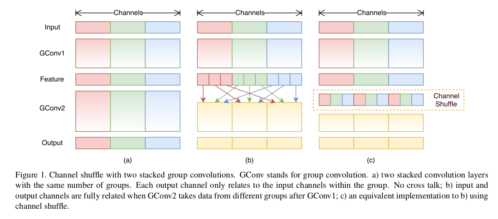
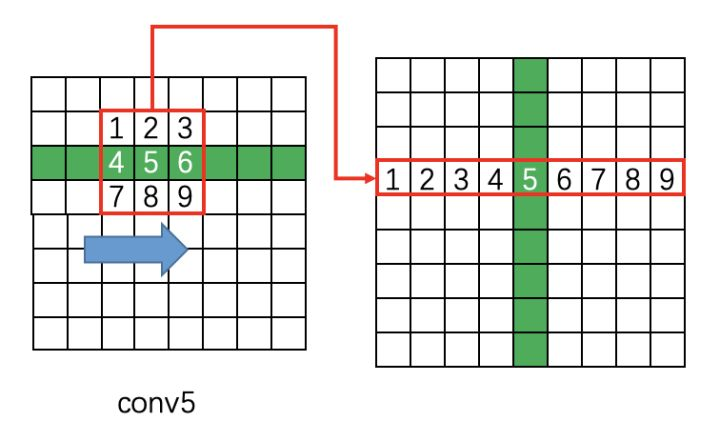

* content
{:toc}

## 序言
基于深度学习算法的的自然场景文本检测，经过几年的研究，针对解决实际问题中的某些问题，涌现出CTC, LSTM等大量的单元。本章节将针对模型设计中常用的
模块进行介绍。

## 问题
- 文本定位
- 序列不定长的问题
- 文字大小不一的问题

## HMM & CTC

### 问题
序列学习任务需要从未分割的输入数据中预测序列的结果。HMM模型与CRF模型是序列标签任务中主要使用的框架，这些方法对于许多问题已经获得了较好的效果，但是它们也有缺点：

- 需要大量任务相关的知识，例如，HMM中的状态模型，CRF中的输入特征选择
- 需要有独立性假设作为支撑；
- 对于标准的HMM模型，它是生成式的，但是序列标签时判别式的。

RNN网络除了输入与输出的表达方式需要选择之外不需要任何数据的先验。
它可以进行判别训练，它的内部状态为构建时间序列提供了强大的通用机制。
此外，其对时间和空间噪声具有很强的鲁棒性。

但是对于RNN呢，它是不能拿来做序列预测的，这是**因为RNN只能去预测一些独立标签的分类，因而就需要进行序列预分割**。要解决该问题，那么将RNN与HMM结合起来被称之为hybrid approach。在该方法中使用HMM为长序列结构数据建立模型，神经网络就提供局部分类。加入HMM之后可以使得在训练中自动分割序列，并且将原本的网络分类转换到标签序列。然而，它并没有避免上述内容中HMM使用缺点。

### 引入CTC
CTC( Connectionist Temporal Classification)，可以解决前面提到的两点局限，直接使用序列进行训练。CTC引入了一个**新的损失函数**，可以使得RNN网络可以直接使用未切分的序列记性训练。为了使用这个损失函数，
为RNN引入其可以输出的"Blank"标签, RNN的输出是所有标签的概率。
这里将Temporal Classification定义为$h$，训练数据集合$S$中数据是成对存在的$(\mathbf{x},z)$，其中$\mathbf{x}$是训练的时序数据，$z$是标签数据。目标就是找到一个时序分类器$h$使得$S$中的$x$被分类到$z$。训练这个分类器，就需要一个错误度量，这里就借鉴了编辑（ED）距离度量，而引入了label error rate（LER）。在这里还对其进行了归一化，从而得到了如下的形式：
$$LER(h, S) = \frac{1}{Z}\sum_{(\mathbf{x},z)\in S} ED(h(\mathbf{x}))$$

将网络输出转换成为基于标签序列的条件概率，从而可以使用分类器对输入按照概率大小进行分类。

### 从网络输出到连续标签

在CTC网络中拥有一个$softmax$输出层，其输出的个数为$∣L∣+1$，$L$是标签元素的集合，额外的一个那当然就是"blank"标签了。这些输出定义了将所有可能的标签序列与输入序列对齐的所有可能路径的概率。任何一个标签序列的总概率可以通过对其不同排列的概率求和得到。
首先对于一条可行的路径$p(\pi|x)$被定义为对应路径上的各个时刻输出预测概率的乘积。其定义如下：
$$p(\pi|x) = \prod^T_{t=1}y_{\pi_t}^t, \quad \forall \pi \in L'^T$$

对于预测结果中的一条路径的标签，论文中假设这些不同时刻网络的输出是相互独立的，而这种独立性是通过输出层与自身或网络之间不存在反馈连接来确保实现的。

在此基础上还定义了映射函数$B$，它的职责就是去除"blank"与重复的标签。因而给定的一个标签其输出概率就可以描述为几个可行路径相加和的形式:

$$ p(l|\mathbf{x}) = \sum_{\pi \in B^{-1}(l)} p(\pi|\mathbf{x}) $$

### 构建分类器

从上面的内容中已经得到了一个序列标签的输出条件概率，那么怎么才能找到输入数据最匹配的标签呢？最为直观的便是求解
$$h(X) = \arg\max_{l\in L \le T} p(l|\mathbf{x})$$
在给定输入情况下找到其最可能的标签序列，这样的过程使用HMM中的术语叫做解码。目前，还没有一种通过易理解的解码算法，但下面的两种方法在实践过程中也取得了不错的效果。

#### 最佳路径解码

该方法是建立在概率最大的路径与最可能的标签时对应的，因而分类器就被描述为如下形式：
$$h(\mathbf{x}) \approx B(\pi^*)$$
$$where\quad \pi^* = \arg\max_{\pi \in N^t}p(\pi|\mathbf{x})$$
从上面的形式中就可以看出，最佳路径解码的计算式很容易的，因为最佳路径中的元素是各个时刻输出的级联。但是呢，这是不能保证找到最可能的标签的。

#### 前缀解码

前缀解码在足够时间的情况下会找到最可能的标签，但是随着输入序列长度的增强时间也会指数增加。如果输入的概率分布是尖状的，那么可以在合理的时间内找到最可能的路径。

实践中，前缀搜索在这个启发式下工作得很好，通常超过了最佳路径解码，但是在有些情况下，效果不佳。

## CTC网络训练

目标函数是由极大似然原理导出的。也就是说，最小化它可以最大化目标标签的对数可能性。有了损失函数之后就可以使用依靠梯度进行优化的算法进行最优化。

CTC在网络中放置在双向递归网络的后面作为序列预测的损失来源。CTC会在RNN网络中传播梯度，进而使得其学习一条好路径。

### CTC前向传播算法

需要一种有效的方法来计算单个标签的条件概率$p(l|\mathbf{x})$。对于这样的问题，其实就是对应于给定标签的所有路径的综合。通常有很多这样的路径。这里我们采用动态规划的算法计算所有可能路径的概率和，其思想是，与标签对应的路径和可以分解为与标签前缀对应的路径的迭代和。
然后，可以使用递归向前和向后变量有效地计算迭代。
以下是本文设计到的一些符号定义：

- $y_{k}^{t}$, 时刻t的输出字符$k$
- $l$, 标签序列对应的损失。
- $l^{\prime}$，相同的标签序列，但是在字符之间添加了"blank"标签

$$\alpha_t(s) \overset{def}{=} \sum_{\pi \in N^T: \atop B(\pi_{1:t}) = l_{1:s}} \prod^t_{t^{\prime} = 1} y_{\pi_{t^{\prime}}}^{t^{\prime}}.$$
其中B是溢出所有"blank"与重复字符的变换；${\pi \in N^T:B(\pi_{1:t}) = l_{1:s}}$ 是时刻1到t的预测矩阵中，给出经过变换$B$之后与标签有前s个一致的所有可行路径；$y^{t^{\prime}}$
是指时刻$t^{\prime}$时RNN的输出。而且$\alpha_{t}(s)$可以通过$\alpha_{t-1}(s)$与$\alpha_{t-1}(s-1)$迭代计算出来。

图3中描述的状态转移图与上面公式的含义是相同的。为了能够在输出路径中出现“blank”标签，将标签修改成了$l^{\prime}$，也就是在标签的前后与字符之前插入空白标签，因而生成的标签长度就变成了$2|l|+1$的长度，使其可以再空白标签与非空白标签之间转换，也可以使非空白标签之间发生转换。
上面的公式1中已经给出了其计算的内容，但其计算并不具有可行性。但是可以根据图3中$\alpha_{t}(s)$的递归定义使用动态规划算法去解决该问题，仔细看这幅图，是不是有点像HMM的前向计算过程。

对于解决该问题使用动态规划的算法进行解决，首先来分析时刻1时候的情况：
$$\alpha_1(1) = y_b^1$$
$$\alpha_1(2) = y_{l^{\prime}}^1$$
$$\alpha_1(s) = 0, \forall s > 2$$

$$\alpha_t(s) = \begin{cases} 
a_t(s)y_{l_{s}^{\prime}}^t, \quad if\quad l_s^{\prime} = b\quad or\quad  l_{s-2}^{\prime} = l_s^{\prime}\\
(\bar{\alpha_t}(s) +\alpha_{t-1}(s -2))y_{l_{s}^{\prime}}^t, \quad otherwise
\end{cases}$$
where $\alpha_t(s) \overset{def}{=} \alpha_{t-1}(s) + \alpha_{t-1}(s-1)$
最后就可以得到一个序列的输出概率
$$p(l|\mathbf{x}) = \alpha_T(|l^{\prime}|) + \alpha_T(|l^{\prime}| -1)$$

### 反向传播算法
反向传播的变量$\beta_{t}(s)$被定义为$t$时刻$l_{s:|l|}$的总概率
$$
\beta_{t}(s) \stackrel{\mathrm{def}}{=} \sum_{\pi \in N^{T} \atop \mathcal{B}(\pi_{t : T}) = l_{s:|l|}} \prod_{t^{\prime}=t}^{T} y_{\pi_{t^{\prime}}^{\prime}}^{t^{\prime}}
$$
$$
\beta_{T}\left(\left|\mathbf{l}^{\prime}\right|\right)=y_{b}^{T}            \\
\beta_{T}\left(\left|\mathbf{l}^{\prime}\right|-1\right)=y_{l_{|l|}}^{T}    \\
\beta_{T}(s)=0, \quad \forall s<\left|\mathbf{l}^{\prime}\right|-1          \\
\beta_{t}(s)=\left\{
    \begin{array}{ll}{
        \overline{\beta}_{t}(s) y_{1 s}^{t}} & {\text { if } 1_{s}^{\prime}=b \text { or } 1_{s+2}^{\prime}=1_{s}^{\prime}} \\
        {\left(\overline{\beta}_{t}(s)+\beta_{t+1}(s+2)\right) y_{1_{s}^{t}}} & {\text { otherwise }}
    \end{array}
\right. 
$$
$$
\begin{array}{l}{
\text {where}}
{\quad\overline{\beta}_{t}(s) \stackrel{\mathrm{def}}{=} \beta_{t+1}(s)+\beta_{t+1}(s+1)}
\end{array}
$$

### 最大似然训练
最大似然训练的目的是同时最大化训练集中所有正确分类的对数概率。因而这里可以将损失函数定义为：
$$
O^{M L}\left(S, \mathcal{N}_{w}\right)=-\sum_{(\mathbf{x}, \mathbf{z}) \in S} \ln (p(\mathbf{z} | \mathbf{x}))
$$
为了使用梯度进行网络训练，因而就需要对网络的输出进行微分，且训练样本是相互独立的，也就是说可以单独考虑了，因而可以将微分写为：
$$
\frac{\partial O^{M L}\left(\{(\mathbf{x}, \mathbf{z})\}, \mathcal{N}_{w}\right)}{\partial y_{k}^{t}}=-\frac{\partial \ln (p(\mathbf{z} | \mathbf{x}))}{\partial y_{k}^{t}}
$$
这里可以用前向后向算法计算上式。主要思想是：对于一个标记l，在给定s和t的情况下，前向和后向变量的内积是对应l所有可能路径的概率。表达式为：
$$
\alpha_{t}(s) \beta_{t}(s)=\sum_{\pi \in \mathcal{B}^{-1}(1) : \atop {\pi_t = l_s^{\prime}}} y_{1_{s}}^{t} \prod_{t=1}^{T} y_{\pi_{t}}^{t}
$$
且根据上面的公式（2）联合可以得到：
$$
\frac{\alpha_{t}(s) \beta_{t}(s)}{y_{1_{s}^{t}}^{t}}=\sum_{\pi \in \mathcal{B}^{-1}(1): \atop {\pi_t = l_s^{\prime}}} p(\pi | \mathbf{x})
$$
再与前面的公式（3）联合可以得到
$$
p(\mathbf{l} | \mathbf{x})=\sum_{s=1}^{\left|\mathbf{l}^{\prime}\right|} \frac{\alpha_{t}(s) \beta_{t}(s)}{y_{1_{s}^{\prime}}^{t}}
$$

## rlstm(Reverse LSTM)整体架构如下，其中需要用到Reverse这种Layer

## ChannelShuffle

一般的分组卷积(如ResNeXt的)仅对$3\times3$的层进行了分组操作，然而$1\times1$的pointwise卷积占据了绝大多数的乘加操作，在小模型中为了减少运算量只能减少通道数，然而减少通道数会大幅损害模型精度。作者提出了对$1\times1$也进行分组操作，但是如图１(a)所示，输出只由部分输入通道决定。为了解决这个问题，作者提出了图(c)中的通道混淆(channel shuffle)操作来分享组间的信息，假设一个卷基层有g groups，每个group有n个channel，因此shuffle后会有$g\times n$个通道，首先将输出的通道维度变形为(g, n)，然后转置(transpose)、展平(flatten)，shuffle操作也是可导的。

图２(a)是一个将卷积替换为depthwise卷积的residual block，(b)中将两个$1\times1$卷积都换为pointwise group convolution，然后添加了channel shuffle，为了简便，没有在第二个pointwise group convolution后面加channel shuffle。根据Xception的论文，depthwise卷积后面没有使用ReLU。(c)为stride > 1的情况，此时在shotcut path上使用$3\times3$的平均池化，并将加法换做通道concatenation来增加输出通道数(一般的设计中，stride=2的同时输出通道数乘2)。

对于$c \times h \times w$的输入大小，bottleneck channels为m，则ResNet unit需要$hw(2cm + 9m^2)FLOPs$，ResNeXt需要$hw(2cm + 9m^2/g)FLOPs$，ShuffleNet unit只需要$hw(2cm/g + 9m)FLOPs$，g表示卷积分组数。换句话说，在有限计算资源有限的情况下，ShuffleNet可以使用更宽的特征图，作者发现对于小型网络这很重要。

即使depthwise卷积理论上只有很少的运算量，但是在移动设备上的实际实现不够高效，和其他密集操作(dense operation)相比，depthwise卷积的computation/memory access ratio很糟糕。因此作者只在bottleneck里实现了depthwise卷积。

https://arxiv.org/pdf/1610.02357.pdf

## 场景文字检测—CTPN原理与实现

https://zhuanlan.zhihu.com/p/34757009

